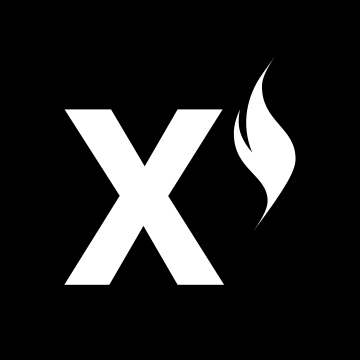

# XION

Welcome to the official documentation for XION!&#x20;

Throughout you'll learn about the origins of the XION layer 1 blockchain, understand how it is uniquely positioned to revolutionize the Web3 landscape, and start building the most user friendly and powerful consumer-facing dApps.

## **Getting Started**

Get familiar with the XION Chain or dive straight into the code.

<table data-view="cards"><thead><tr><th></th><th></th><th></th><th data-hidden data-card-target data-type="content-ref"></th></tr></thead><tbody><tr><td></td><td><strong>What is XION?</strong></td><td>XION is the first layer-one blockchain purpose built for consumer adoption by abstracting away the complexities of crypto.</td><td><a href="learn/overview.md">overview.md</a></td></tr><tr><td>👨💻</td><td><strong>Developer Guides</strong></td><td>Rich guides and coding examples to help you build your own powerful consumer-facing dApps.</td><td><a href="develop/overview.md">overview.md</a></td></tr></tbody></table>

