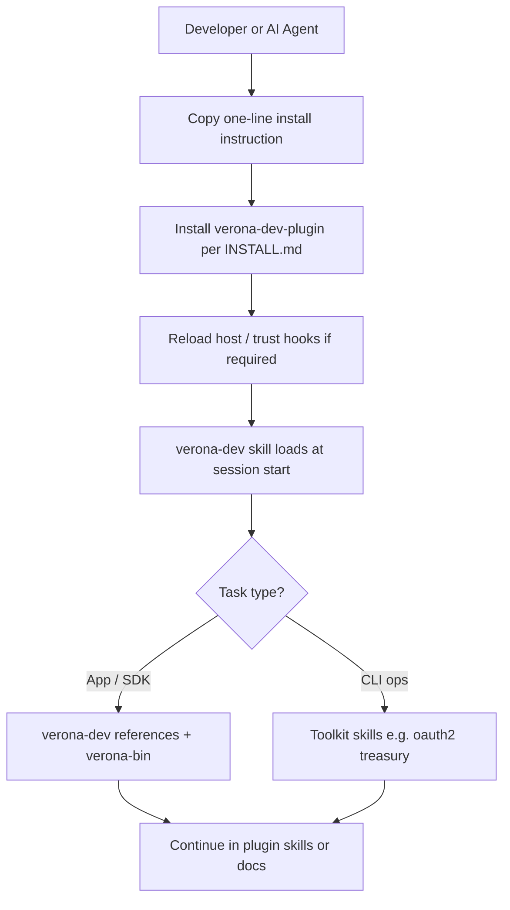

# For AI Agents

**Agents that can finally act.** An agent needs provable information to act—and it cannot hold your sensitive data. Verona lets agents act on what the user has already verified, without rechecking, by reading scoped attestations from the network instead of scraping or storing raw records.

Want to let an AI coding agent work on Verona with the right skills, routing, and gasless workflows?

Copy the instruction below into your AI coding assistant:

```
Follow this guide https://raw.githubusercontent.com/burnt-labs/verona-dev-plugin/main/INSTALL.md to install and configure the Verona Dev Plugin for AI coding agents.
```


The plugin supports **Cursor**, **Codex**, **Claude Code**, and **Kimi**. Host-specific install steps live in [INSTALL.md](https://github.com/burnt-labs/verona-dev-plugin/blob/main/INSTALL.md) — do not improvise paths or marketplace flows from memory.



**Beta:** The `verona-toolkit` CLI (installed via plugin skills when needed) is in **beta**. It supports **testnet** (default) and **mainnet**—use `--network mainnet` or `verona-toolkit config set-network mainnet` for production. Start on testnet for development; the faucet is testnet-only.


## What this gives you

- **One plugin, shared skills** — Meta Account auth, treasury, OAuth2 clients, app SDK guides, and `xiond` helpers under a single `skills/` tree
- **Session entry via `verona-dev`** — routes app development vs toolkit CLI work so the agent picks the right lane
- **Host-native install** — Cursor, Codex, Claude Code, and Kimi each discover the plugin through their manifest conventions (see INSTALL.md)
- **A path to verified context** — combine plugin workflows with [Truth Engine](concepts/verification-infrastructure/) attestations so agents act on proofs, not guesses

## High-level flow



## Continue to full guide

<table data-view="cards"><thead><tr><th></th><th data-hidden data-card-target data-type="content-ref"></th></tr></thead><tbody><tr><td><strong>Verona Dev Plugin — Install</strong><br>Host-specific install, session hooks, legacy skill cleanup, and updates.</td><td><a href="https://github.com/burnt-labs/verona-dev-plugin/blob/main/INSTALL.md">INSTALL.md</a></td></tr><tr><td><strong>Verona Agent Toolkit Tutorial</strong><br>CLI reference for auth, treasury, OAuth2 client management, and troubleshooting when the agent routes to toolkit skills.</td><td><a href="../developers/tools/verona-toolkit.md">verona-toolkit.md</a></td></tr></tbody></table>

## Related

- [What is Verona?](concepts/overview.md) — the gap, the unlock, and developer primitives
- [Burnt Verified](surfaces/burnt-verified.md) — verified credentials for agent workflows
- [Build on Verona](../developers/overview.md)

## References

- [Verona Dev Plugin Repository](https://github.com/burnt-labs/verona-dev-plugin)
- [Install the plugin (INSTALL.md)](https://github.com/burnt-labs/verona-dev-plugin/blob/main/INSTALL.md)
- [Verona Agent Toolkit Repository](https://github.com/burnt-labs/verona-agent-toolkit) — CLI binary distribution and command reference
