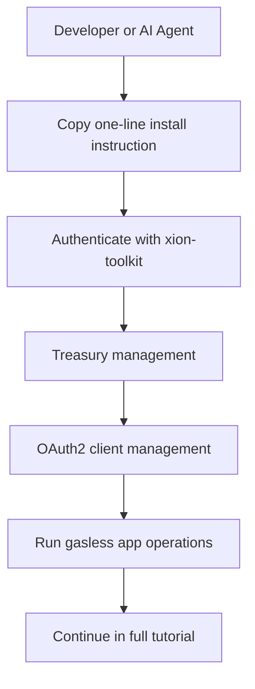

# For AI Agents

**Agents that can finally act.** An agent needs provable information to act—and it cannot hold your sensitive data. Verona lets agents act on what the user has already verified, without rechecking, by reading scoped attestations from the network instead of scraping or storing raw records.

Want to let an AI agent operate on the network with a gasless workflow?


**Beta:** Verona Agent Toolkit (CLI package `xion-toolkit`) is in **beta**. It supports **testnet** (default) and **mainnet**—use `--network mainnet` or `xion-toolkit config set-network mainnet` for production. Start on testnet for development; the faucet is testnet-only.


Copy the instruction below into your AI coding assistant:

```
Follow this guide https://raw.githubusercontent.com/burnt-labs/xion-agent-toolkit/main/INSTALL-FOR-AGENTS.md to install and configure the Verona Agent Toolkit skills for AI agents.
```


This setup is designed for AI-assisted development with Meta Accounts, Treasury management, and OAuth2 client management. It is not limited to one IDE. On-chain operations still use chain IDs such as `xion-testnet-2` and the `xiond` CLI where applicable.


## What this gives you

* **Meta Account auth** via OAuth2 (no private key management)
* **Treasury management** for gasless operations and delegated permissions
* **OAuth2 client management** for app registration and lifecycle
* **Agent-friendly workflows** through skills like `xion-dev`, `xion-oauth2`, `xion-treasury`, and `xion-oauth2-client`
* **A path to verified context** — combine toolkit flows with [Truth Engine](concepts/verification-infrastructure/) attestations so agents act on proofs, not guesses

## High-level flow



## Continue to full guide

<table data-view="cards"><thead><tr><th></th><th data-hidden data-card-target data-type="content-ref"></th></tr></thead><tbody><tr><td><strong>Verona Agent Toolkit Tutorial</strong><br>Step-by-step guide for installation, auth, treasury workflows, OAuth2 client management, and troubleshooting.</td><td><a href="../developers/tools/verona-toolkit.md">verona-toolkit.md</a></td></tr></tbody></table>

## Related

* [What is Verona?](concepts/overview.md) — the gap, the unlock, and developer primitives
* [Burnt Verified](surfaces/burnt-verified.md) — verified credentials for agent workflows
* [Build on Verona](../developers/overview.md)

## References

* [Verona Agent Toolkit Repository](https://github.com/burnt-labs/xion-agent-toolkit)
* [Install for AI Agents](https://raw.githubusercontent.com/burnt-labs/xion-agent-toolkit/main/INSTALL-FOR-AGENTS.md)
* [CLI Reference](https://github.com/burnt-labs/xion-agent-toolkit/blob/main/docs/cli-reference.md)
