# Verona Litepaper

## AI를 지능적으로 만들기

AI를 위한 인텔리전스 레이어. 현실 세계에 관한 검증된 사실을 사용자가 소유하고, 어떤 에이전트든 재사용할 수 있게 한다.

2026년 6월

---

## 초록

Verona는 AI를 위한 인텔리전스 레이어다. 사용자가 검증한 데이터를 이동 가능하고, 프라이빗하며, 프로그래밍 가능한 형태로 만들어, 어떤 에이전트든 사용자가 실제로 소유한 정보에 기반해 거래할 수 있게 한다.

오늘날 에이전트는 말할 수 있지만 행동할 수는 없다. 에이전트에게 필요한 한 가지, 즉 사용이 허용된 검증된 사실이 에이전트가 접근할 수 있는 형태로 존재하지 않기 때문이다. Verona는 그 사실을 존재하게 만든다. 사실은 원천에서 한 번 검증되고, 사용자가 소유하며, 사용자가 승인한 모든 에이전트가 기초 데이터를 노출하지 않고 재사용한다. 이 네트워크는 원천 검증, 신뢰 실행, 프라이빗 결제, 형식 검증, 스테이블코인 기반 프로그래머블 결제를 결합하며, 이미 실제 애플리케이션에서 수익을 창출하고 있다. 한 번 검증하고, 어디서나 재사용하며, 아무것도 노출하지 않는다.

## 1 서론

### 1.1 격차

AI는 글을 쓰고, 계획을 세우며, 대화를 이어갈 수 있다. 하지만 당신에 대해 참인 것에 기반해 행동할 수는 없다. 에이전트에게 처방전 갱신, 아파트 신청, 대출 재융자를 요청하면, 검증된 사실이 필요한 첫 단계에서 멈춘다. 필요한 것은 소득, 신원, 자격이다. 모델은 유창하지만 작업은 종료된다. 유창하다는 것은 어떤 것이 참임을 안다는 것과 같지 않다. 검증된 정보에 기반해 행동할 수 없는 에이전트는 지능적이지 않다. 지능은 참인 것에 기반해 행동하는 능력이다.

### 1.2 행동할 검증된 데이터가 없다

신원 확인, 신용 조회, 소득 심사 등 검증은 끊임없이 일어난다. 그러나 그 결과는 사용되는 순간 버려진다. 다음 서비스는 다시 처음부터 시작한다. 데이터가 설명하는 사람은 그 어느 것도 소유하지 않으며, 사용할 수 있는 사실을 찾는 에이전트는 아무것도 찾지 못한다. 전체 스택이 사람에게 또 하나의 문서를 업로드하라고 요청할 수 있다는 전제로 만들어졌기 때문이다. 에이전트는 문서를 업로드하지 않는다. 이것이 Verona가 메우는 격차다.

### 1.3 해제되는 가능성

Verona는 사실을 한 번 검증하고, 소유권을 사용자에게 넘기며, 사용자가 승인한 모든 에이전트가 이를 재사용하게 한다. 이때 기초 데이터는 원래 위치에 남아 있고 누구에게도 보이지 않는다. 하나의 검증된 사실도 유용하다. 그러나 그 사실이 설명하는 사람들이 소유하고 모든 에이전트가 접근할 수 있는 재사용 가능한 검증된 사실의 네트워크는 인터넷의 새로운 레이어다. Verona는 네 가지 아이디어 위에 구축된다.

원시 요소로서의 검증된 사실. 검증은 사용 후 사라지는 일회성 확인이 아니라 사용자가 소유하는 지속적 자산이 된다.

프라이빗 결제. 사실과 그 사실에 기반한 행동은 공개 상태와 프라이빗 상태가 혼합된 하나의 체인에서 결제된다.

형식 검증. 체인은 기계 검증 사양에 대해 검증될 수 있도록 구축되어, 에이전트가 이를 신뢰하고 의존할 수 있다.

프로그래머블 결제. 에이전트는 행동의 일부로서 스테이블코인으로 가치를 자동 결제한다.

## 2 핵심 아키텍처

Verona는 하나의 네트워크다. 현실 세계의 원천이 데이터를 공급하고, 다섯 가지 기능이 이를 작동하게 하며, 사용자, 에이전트, 기업, 그리고 그 위에 구축된 애플리케이션이 동일한 검증된 사실 집합을 활용한다.

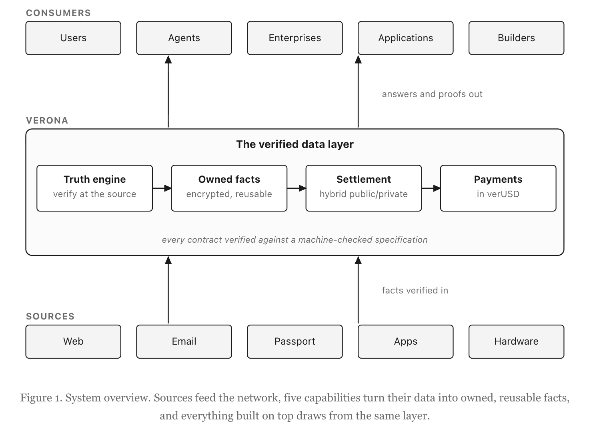

### 2.1 원천 검증

Verona는 사용자에게 데이터를 넘기라고 요구하지 않는다. 이미 그 사실을 보유한 시스템에서 증명을 생성하며, 원시 데이터는 이동하지 않는다. 증명은 사실이 어디에서 왔는지에 맞춰진다. 웹 세션에는 zkTLS, 이메일에는 zkEmail, 여권에는 zkPassport, 애플리케이션에는 앱 또는 엔클레이브 증명, 실제로 존재하고 현장에 있는 사람의 증명에는 사진 증명, 하드웨어 증명에는 하드웨어 증명에 대한 온체인 영지식 증명인 zkDCap이 사용된다. 증명을 소비하는 누구나 이를 독립적으로 확인한다. 증명과 attestation은 원천까지 추적 가능하고, 모든 스마트 컨트랙트와 Verona 소스 코드는 공개되어 검증 가능하며, 스택의 어떤 부분도 Verona에 대한 검증 불가능한 신뢰를 요구하지 않는다. 데이터의 출처와 선택적 공개의 유효성은 수신자가 감사할 수 있다. 원천 검증은 실제 급여 제공자에 대해 오늘 이미 작동하고 있으며, 문서를 저장하지 않고도 몇 초 안에 소득 및 고용 증명을 반환한다.

### 2.2 사용자가 소유하고 재사용하는 사실

검증된 사실은 사용자에게 암호화되어 네트워크에 보관된다. 사용자가 수신자, 에이전트, 서비스 또는 다른 엔클레이브를 승인하면, 네트워크는 그 사실을 해당 수신자에게 다시 암호화하고, 신뢰 실행 환경은 수신자가 필요로 하는 정확한 답으로 이를 변환한다. 수신자는 데이터가 아니라 답과 증명을 받는다. 전송 중에는 아무것도 노출되지 않으며, 사용자는 키를 보유할 필요가 없다. 한 번의 검증은 사용자가 승인한 모든 수신자에게 재사용될 수 있으므로, 한 번 끝낸 작업은 반복되지 않는다. 이것이 사용 시 끝나는 확인과 계속 가치를 내는 사실의 차이다.

저장된 데이터는 수신자가 필요로 하는 답만으로 변환될 수 있으며, 허위 또는 조작된 주장에 여지를 남기지 않는다. 키 관리는 검증 가능하고 재현 가능한 빌드 위의 하드웨어 엔클레이브 안에서 실행되므로 사용자는 키를 직접 다루지 않는다. 키 처리는 모든 블록체인 도구에서 가장 마찰이 크고 위험이 높은 부분이지만, 여기서는 사용자의 시야에서 완전히 사라진다.

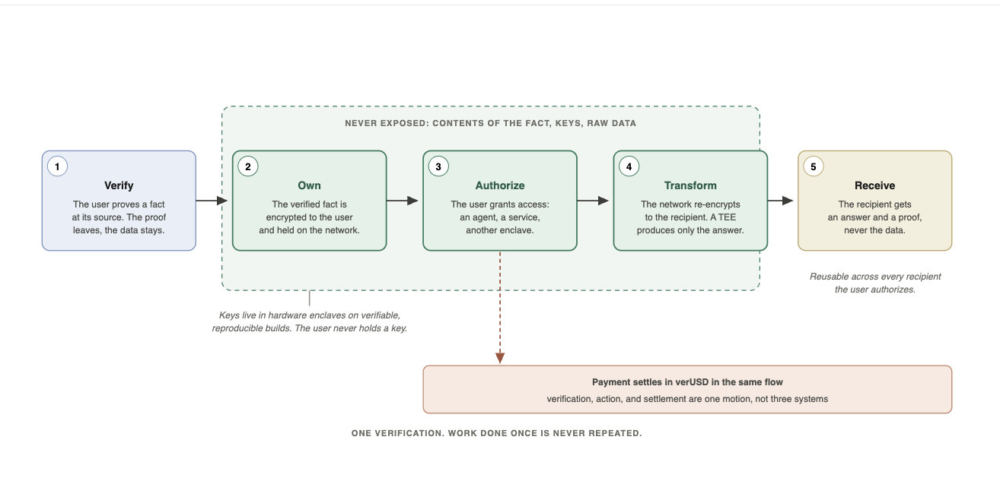

### 2.3 프라이빗 결제

사실과 그 사실에 기반한 행동은 공개 상태와 프라이빗 상태가 혼합된 단일 체인에서 결제된다.

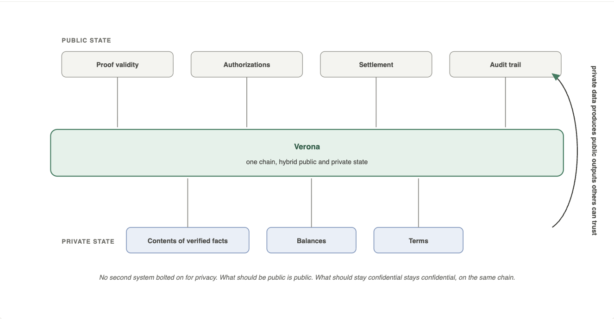

공개되어야 할 것은 공개되고, 잔액, 조건, 검증된 사실의 내용처럼 기밀로 유지되어야 할 것은 같은 체인에서 기밀로 유지된다. 하드웨어 엔클레이브에 보관된 키와 공개된 출처 스택을 통해, 프라이빗 데이터는 다른 사람들이 신뢰하고 행동할 수 있는 공개 출력을 만들어낼 수 있다. 프라이버시를 위해 덧붙인 두 번째 시스템은 없다. 하나의 체인이다.

### 2.4 형식 검증

Verona는 감사될 뿐 아니라 검증되도록 구축된다. 모든 컨트랙트는 기계 검증 사양에 대해 확인되며, 그 사양은 적대적 프로세스를 통해 만들어진다.

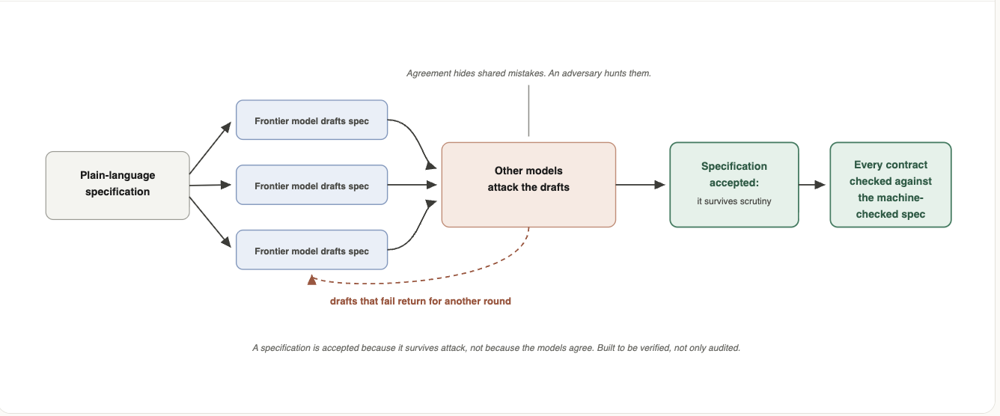

여러 프런티어 모델이 사양을 초안으로 작성하고, 다른 모델들이 그 초안을 공격한다. 사양이 채택되는 이유는 모델들이 동의했기 때문이 아니라, 검토를 견뎌냈기 때문이다. 동의는 공유된 실수를 숨긴다. 적대자는 그것을 찾아낸다. 이것이 체인이 기반으로 하는 신뢰 모델이며, 에이전트가 체인의 동작을 희망의 대상이 아니라 의존 가능한 대상으로 취급할 수 있게 하는 이유다.

### 2.5 프로그래머블 결제

네이티브 결제 레일은 에이전트가 행동하는 바로 그 순간 그 행동에 대해 스테이블코인 단위로 결제하게 하며, 사람이 각 이체를 승인하기 위해 개입할 필요가 없다. 검증, 행동, 결제는 서로 분리된 세 시스템이 아니라 하나의 흐름 안에서 일어난다.

## 3 네트워크

사용자는 현실 세계와 디지털 사실을 재사용 가능한 증명으로 바꾸고, 빌더는 그 증명 위에 애플리케이션을 만들며, 기업은 자체 사용자와 워크플로를 검증하고, 에이전트는 서로를 신뢰하거나 원시 민감 데이터를 처리하지 않고도 행동한다. 모든 당사자가 동일한 검증된 사실 집합을 활용하며, 이것이 제품을 네트워크로 바꾼다.

Verona는 모든 참여자가 동일한 검증된 사실 네트워크에 가치를 더하기 때문에 복합적으로 성장한다. 사용자는 공급을 더한다. 애플리케이션, 기업, 에이전트는 수요를 만든다. 빌더는 사실이 사용될 수 있는 범위를 넓힌다. 원천 시스템은 증명 가능한 것을 늘린다. 결제와 정산은 그 활동을 경제로 전환한다.

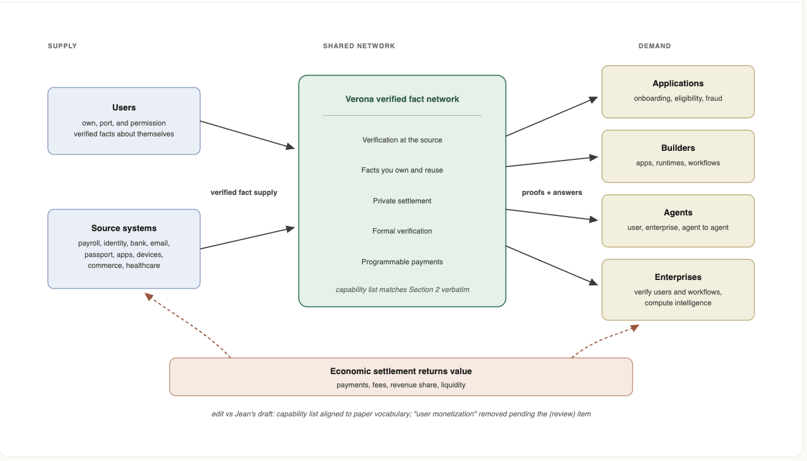

- 사용자는 자신에 관한 허가된 검증 사실을 공급한다. 한 번 검증하고, 결과를 소유하며, 어떤 애플리케이션, 기업, 에이전트 또는 엔클레이브가 이를 사용할 수 있는지 결정한다. 사용자가 얻는 것은 이동성, 프라이버시, 재사용성이고, 궁극적으로 자신이 만든 사실이 어떻게 수익화되는지에 대한 발언권이다.

- 애플리케이션은 그 사실들에 대한 수요를 만든다. Verona를 사용해 사용자 온보딩, 자격 확인, 사기 감소, 워크플로 완료를 수행하며, 원시 민감 데이터를 수집하거나 저장하지 않는다. 또한 모든 애플리케이션은 사용자가 한 번 검증하고 다른 곳에서 재사용할 이유를 하나 더 제공한다.

- 빌더는 네트워크를 넓힌다. 검증, 동의, 결제 배관을 직접 재구축하는 대신, 진실 원시 요소 위에 애플리케이션, 에이전트 런타임, 워크플로, 통합을 출시한다.

- 기업은 두 가지 방식으로 참여한다. 먼저 자체 사용자, 고객, 근로자, 거래, 자격 증명, 적격성을 검증하기 위해 들어온다. 검증된 사실이 축적되면, 기업은 허가된 데이터를 소비하고 계산하기 위해 머문다. 검증은 첫 번째 사용 사례이고, 검증된 인텔리전스가 더 큰 사용 사례이기 때문이다.

- 에이전트는 개인을 위해, 기업을 위해, 또는 서로 간에 검증된 사실을 활용한다.

- 원천 시스템과 검증자는 네트워크가 알 수 있는 범위를 확장한다. 급여 제공자, 신원 시스템, 은행, 이메일, 여권, 앱, 기기, 커머스 플랫폼, 헬스케어 시스템은 각각 검증되는 사실에 맞는 증명을 생성하며, 새로운 원천이 추가될수록 네트워크의 사실은 더 넓고 더 좋아진다.

- 토큰 및 네트워크 참여자는 그 위의 모든 것을 위해 결제, 보안, 유동성을 제공하는 경제 레이어를 운영한다.

## 4 무엇을 가능하게 하는가

이것들은 하나의 네트워크로 이어지는 접점이지, 별개의 제품이 아니다.

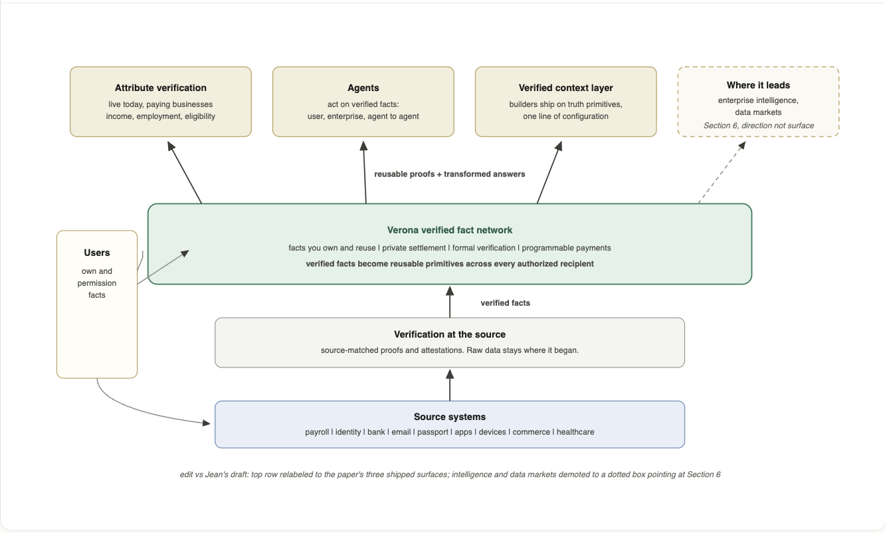

### 4.1 속성 검증

첫 번째 접점은 속성 검증이다. Verona는 로그인 뒤의 웹사이트에서 사용자가 보유한 모든 속성을 검증한다. 소득과 고용, 지출, 활동, 로열티 등급, 계정 보유 기간처럼 일반적으로 사일로에 갇혀 공유할 방법이 없는 데이터다. 사용자가 로그인하면, 네트워크는 해당 속성이 정해진 조건을 충족한다는 암호학적 증명을 반환한다. 문서는 업로드되지 않고 원시 데이터도 저장되지 않는다. 이는 대체 대상인 문서 업로드 절차보다 더 빠르고, 저렴하며, 신뢰할 수 있고, 이미 유료 기업과 함께 운영 중이다. 부동산 부문의 소득 및 고용 검증은 하나의 예이며, 같은 접근 방식은 대출, 보험, 그리고 자기 보고가 아니라 검증된 속성에 기반해 행동해야 하는 모든 비즈니스로 확장된다. 각 증명은 다시 수집되는 대신 재사용된다.

### 4.2 검증된 사실에 기반해 행동하는 에이전트

두 번째 접점은 에이전트이며, 에이전트는 한 가지 이상의 방식으로 참여한다.

- 사용자 에이전트는 개인을 위해 행동하며, 사용자가 다시 증명할 필요 없이 그 사람의 검증된 사실을 작업으로 가져온다.

- 기업 에이전트는 검증된 입력에만 기반해 행동하므로, 자동화된 결정은 주장보다 증명에 기반한다.

- 에이전트 대 에이전트에서는 자율 시스템이 서로 자체를 신뢰하는 대신 서로의 증명을 신뢰해 거래하며, 중간에서 보증할 인간이 필요 없다.

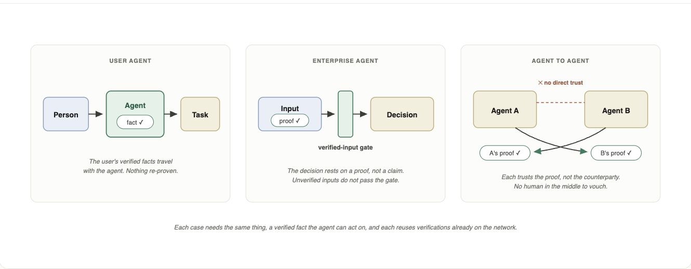

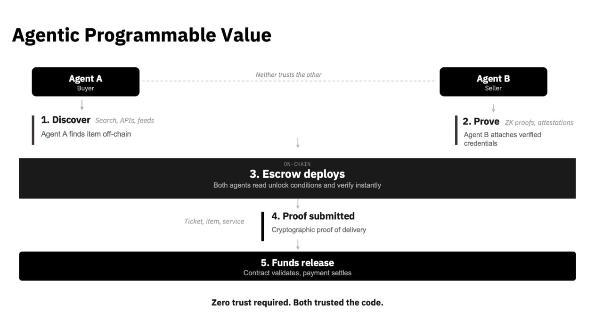

각 사례에는 동일한 것이 필요하다. 에이전트가 행동할 수 있는 검증된 사실이다. 그리고 각 사례는 처음부터 시작하는 대신 네트워크에 이미 있는 검증을 재사용한다.

### 4.3 빌더를 위한 검증된 컨텍스트 레이어

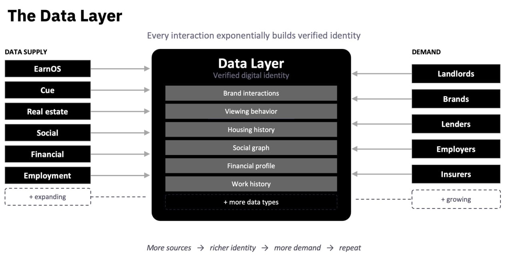

세 번째 접점은 빌더다. 표준 프로토콜을 사용하는 모든 에이전트 런타임은 한 줄의 설정만으로 검증되고 사용자 동의를 받은 사실에 접근할 수 있다. 빌더는 검증, 컴플라이언스, 결제, 데이터 수집을 처음부터 다시 만드는 대신 진실 원시 요소 위에 구축한다. Verona는 신원과 도구 사이에 위치하여 검증된 컨텍스트를 공급하는 레이어가 되며, Verona가 반환하는 증명은 네트워크의 모든 다른 서비스에서 재사용 가능하다.

## 5 왜 복합적으로 성장하는가

일반적인 검증 제품은 매번 다시 시작한다. 사용자가 무언가를 증명하고, 애플리케이션이 이를 확인하며, 결과는 그 워크플로 안에서 사라지고 아무것도 축적되지 않는다.

Verona는 다르게 작동한다. 모든 검증된 사실은 사용자가 통제하는 재사용 가능한 원시 요소가 되어, 애플리케이션과 에이전트가 행동할 수 있는 더 많은 신뢰 컨텍스트를 제공한다. 새로운 애플리케이션은 사용자에게 검증할 이유를 더 많이 제공한다. 새로운 기업 워크플로는 정확하고, 허가되었으며, 원천으로 뒷받침된 사실에 대한 수요를 만든다. 새로운 원천은 네트워크가 증명할 수 있는 범위를 넓힌다.

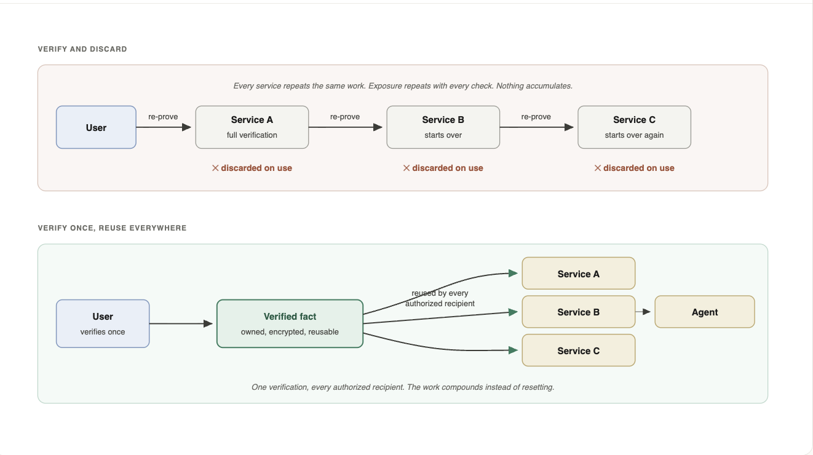

공급과 수요는 서로를 강화하므로, 네트워크는 사용할수록 더 강해지고 매번 확인할 때마다 초기화되지 않는다. 검증하고 폐기하는 모델은 이 중 아무것도 축적할 수 없으며, 사용이 늘어날수록 격차는 벌어진다.

해자는 하나의 증명, 하나의 고객, 하나의 애플리케이션이 아니다. 해자는 재사용 가능한 검증된 사실의 성장하는 네트워크이며, 그 사실은 그것이 설명하는 사람들이 소유하고, 승인된 모든 애플리케이션, 기업, 에이전트가 접근할 수 있다.

## 6 어디로 이어지는가

Verona는 애플리케이션을 위한 사실 검증에서 시작한다. 이것이 첫 번째 웨지다. 더 빠른 소득 확인, 고용 검증, 자격 확인, 자격 증명, 그리고 기업이 주장 대신 사실에 기반해 행동해야 하는 기타 워크플로다.

그 사실들이 축적되면서 Verona는 검증 레이어 이상의 것이 된다. 허가형 인텔리전스 레이어가 된다. 기업과 에이전트는 원천으로 뒷받침되고 사용자 동의를 받은 사실 위에서 계산하여, 기초 데이터를 노출하지 않고 더 나은 결정을 내릴 수 있다. 대출기관은 검증된 소득을 바탕으로 추론할 수 있다. 보험사는 검증된 자격 또는 사건을 바탕으로 추론할 수 있다. 마켓플레이스는 검증된 평판 또는 거래 이력을 바탕으로 추론할 수 있다. 전략팀은 오래된 패널과 추정 데이터 대신 허가된 사실을 통해 시장 행동을 이해할 수 있다.

레거시 시장 인텔리전스는 대리 지표 위에 구축되어 있다. 패널, 설문, 브로커, 스크래핑된 신호, 오래된 데이터셋, 추정 행동이 그것이다. Verona는 이러한 대리 지표를 검증된 사실 위의 허가된 계산으로 대체한다. 사용자는 통제를 유지하고, 원시 데이터는 프라이빗하게 남으며, 출력은 애플리케이션, 기업, 에이전트가 신뢰할 수 있는 것이 된다.

이것이 네트워크의 더 큰 방향이다. 경제 인프라로서의 검증된 데이터, 그리고 어떤 것이 참인지 알아야 할 때 애플리케이션, 기업, 에이전트가 찾아가는 장소로서의 Verona다.

## 7 토큰

토큰은 두 가지다. VERONA와 스테이블코인이다.

### 7.1 가치를 창출하는 네트워크

Verona는 모든 거래에 과세할 가치가 있다는 가정을 거부한다. Verona는 자신이 지원하는 애플리케이션의 수익 일부를 가져오는 방식으로 수익을 얻는다. 네트워크는 그 애플리케이션들이 성공할 때 성공하며, 스팸에서는 아무것도 얻지 않기 때문이다. Verona는 오늘 이미 수익을 올리고 있으며, 그 수익이 토큰을 지원한다. 가치는 거래 수를 세는 것이 아니라 실제 경제 활동에서 발생한다.

### 7.2 가치가 축적되는 방식

순수익은 바이백 및 소각에 사용된다.

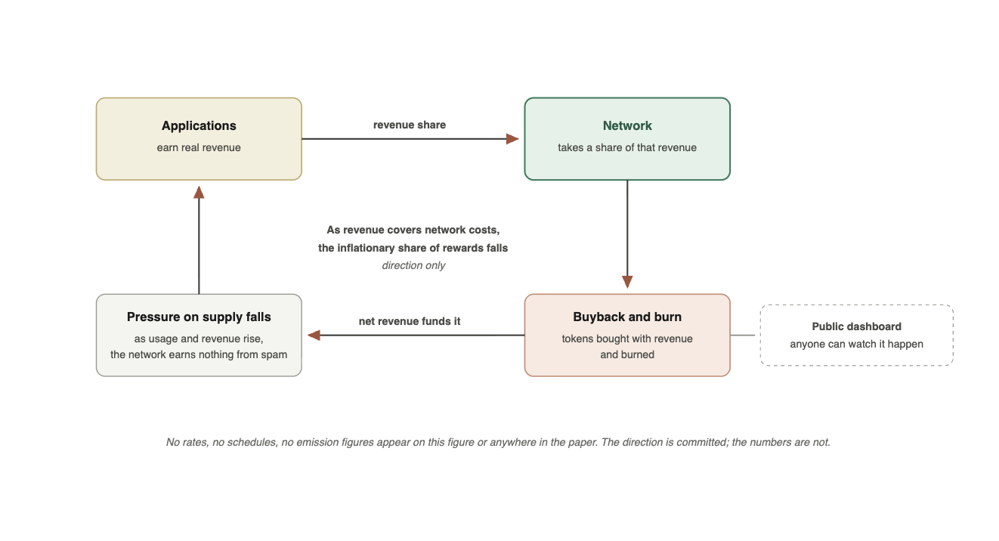

토큰은 수익으로 다시 매입되어 소각되고, 그 수량은 누구나 확인할 수 있도록 공개 대시보드에 표시된다. 수익이 네트워크 운영 비용을 충당할 만큼 성장하면, 보상의 인플레이션적 비중은 낮아진다. 방향은 정해져 있다. 사용량과 수익은 증가하고, 공급 압력은 감소한다. 정확한 일정은 여기서 고정하지 않으며, 아직 약속할 준비가 되지 않은 바이백률, 소각률, 발행 수치는 공개하지 않는다.

### 7.3 스테이블코인

Verona는 규제된 발행자가 발행하는 일대일 완전 준비 디지털 달러를 갖게 될 것이다. 이는 계층형 구조 아래에서 준비금에서 발생하는 수익을 수반한다. 보유자는 네트워크 전반의 결제와 정산에 사용할 안정적인 단위를 얻고, 스테이블코인은 에이전트가 자신이 하는 일에 대해 지불할 때 사용하는 단위가 된다.

## 8 결론

AI는 참인 것에 기반해 행동할 수 있을 때 지능적이 된다. 이를 위해서는 그것이 설명하는 사람들이 소유하고, 어떤 에이전트든 재사용할 수 있으며, 누구에게도 노출되지 않는 검증된 사실이 필요하다. Verona는 그 사실들이 존재하는 네트워크이며, 에이전트 경제가 구축되는 레이어다. 한 번 검증하고, 어디서나 재사용하며, 아무것도 노출하지 않는다. AI를 지능적으로 만들기.

## 참고문헌

D. Boneh and M. Franklin. Identity-Based Encryption from the Weil Pairing. CRYPTO 2001.

DomainKeys Identified Mail (DKIM) Signatures. RFC 6376.

The Transport Layer Security (TLS) Protocol Version 1.3. RFC 8446.

Intel Trust Domain Extensions (Intel TDX). Intel Corporation.

---

본 문서는 일반 정보 제공만을 목적으로 한다. 투자 조언이 아니며, 어떤 토큰 또는 기타 수단을 판매하기 위한 제안이나 구매 권유가 아니다. 법률, 세무 또는 회계 의사결정에 의존해서는 안 된다. Verona는 활발히 개발 중이며, 여기에 설명된 모든 기능은 변경될 수 있다. 미래에 관한 진술은 예고 없이 변경될 수 있다. 스테이블코인은 규제된 완전 준비 디지털 달러이며, 준비금에서 발생하는 모든 수익은 재량적이고 준비금 성과에 따라 달라진다.
