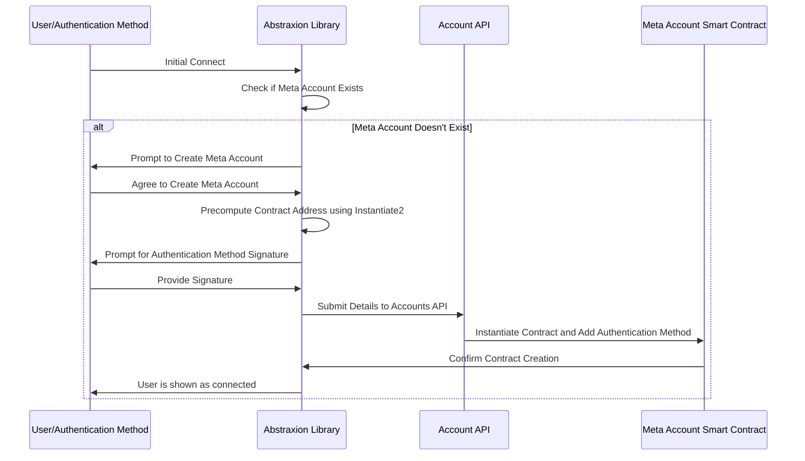
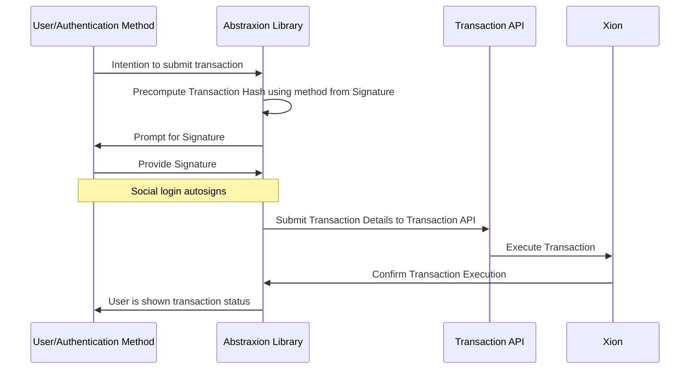

# Meta Accounts Design

**Overview**

XION’s modular _meta accounts_ introduce a highly adaptable and secure account creation & management framework.

Built at the protocol-level, _meta accounts_ have a host of benefits over traditional crypto wallets and enable novel Web3 application use-cases. See [generalized-abstraction](../../../learn/learn-about-xion/generalized-abstraction/ "mention") for more information around use cases and features.

## Components

Identity Provider

In the case of social login a trusted Identity provider must be used to handle the confirmation of identity, in this case [Stytch](https://stytch.com/) is being used.

Account API

A set of services used to assist and sponsor new meta account creation.&#x20;

See the [repo](https://github.com/burnt-labs/account-abstraction-api)

Abstraxion Library

This graz-based frontend library aids in integration with your react front end.

See the [repo](https://github.com/burnt-labs/abstraxion)

Meta Account Smart Contract

This contract along with a custom XION module represent the core of the meta account functionality.

See the [repo](https://github.com/burnt-labs/contracts)

## Supported Authentication Methods

* Email login
* Keplr (or any wallet supporting [ADR-036](https://github.com/cosmos/cosmos-sdk/blob/main/docs/architecture/adr-036-arbitrary-signature.md))
* EIP-191 Signatures
* (MetaMask, biometrics, and many more coming soon)

## Workflows

### Account Create

### Transaction submission

