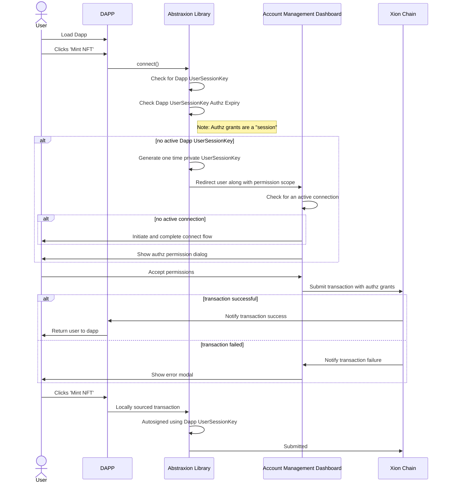

# Meta Accounts Design

**Overview**

XION’s modular _meta accounts_ introduce a highly adaptable and secure account creation & management framework.

Built at the protocol-level, _meta accounts_ have a host of benefits over traditional crypto wallets and enable novel Web3 application use-cases. See [generalized-chain-abstraction](../../learn-about-xion/generalized-chain-abstraction/ "mention") for more information around use cases and features.

## Components

Identity Provider

In the case of social login an identity provider is used to handle the confirmation of identity.

Account API

A set of services used to assist and sponsor new meta account creation.&#x20;

Abstraxion Library

This frontend library aids in integration with your react front end.

See the [repo](https://github.com/burnt-labs/xion.js)

Meta Account

This contract along with a custom XION module represent the core of the meta account functionality.

See the [repo](https://github.com/burnt-labs/contracts)

UserSessionKey

The temporary key generated on the DAPP side which is granted ContractExecutionAuthorization by the user's Meta Account on a temporary basis.

FeeGrantTreasury

A account a dapp may user to sponsor transactions submitted by the UserSessionKey.

## Supported Authentication Methods

* Email login
* (MetaMask, biometrics, and many more coming soon)

## Workflows

