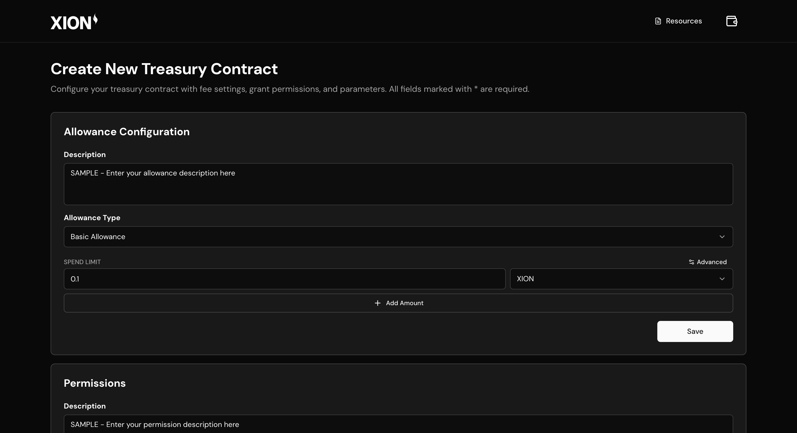

# Treasury Contracts

The introduction of treasury contracts enables an OAuth-like authentication flow (fully on-chain), creation of complex allowance systems that provides granular control of allowances to the developer, as well as gas-less experience for the end users. This guide demonstrates how to use the developer portal to deploy your dApp’s first treasury contract.


One treasury contract deployment is meant for a single dApp. Think of it as setting up OAuth for your app (your dApp requests access of data from the Xion chain on behalf of the user, without getting access to private information)


## Xion Developer Portal


The portal is available at [https://dev.testnet.burnt.com/](https://dev.testnet.burnt.com/) 🖥️


### Login to the Portal

<figure><figcaption></figcaption></figure>

### Select the Account

<figure><figcaption></figcaption></figure>

### On the Dashboard

This is where all your deployed treasury contracts will be visible


Remember: Details of any contract deployed from here is stored in the local storage, so moving between browsers or devices won’t retain the list of treasury contracts deployed by your account.


<figure><figcaption></figcaption></figure>

Click on “New treasury”:

<figure><figcaption></figcaption></figure>

## Selecting Config for your dApp


Remember: All the config generated here can be edited and customized - but make sure the keys are always in snake\_case and not camelCase



Remember: Feel free to edit the “description” string in configuration objects to appropriate description based the intention behind the request. The user will see this description when they click “Allow” after connecting their account.



Click encode to see what the final config looks like after setting appropriate values for the Fee and Grant configs. Eg.,


Fee Grant config:

<figure><figcaption></figcaption></figure>

Grant config:

<figure><figcaption></figcaption></figure>

After clicking “save config” for both Fee and Grant config, the modal will display two configuration JSON objects under “Treasury Instance Preview”

<figure><figcaption></figcaption></figure>

Once you have confirmed the data here - click “Create”


The contract is going to be displayed under "Treasury Contracts" on the Portal

<figure><figcaption></figcaption></figure>

## On the Client (React App)


Upgrade to the latest version of `@burnt-labs/abstraxion` package in your react application


Copy over the treasury contract address from the dashboard and paste it in `AbstraxionProvider` component’s config parameter

```typescript
const config = {
	treasury: `CONTRACT_ADDRESS`,
	// optional (only for mainnet)
	// rpcUrl: ``,
	// restUrl: ``
}
```


As opposed to instantiating the config in the current format:

<figure><figcaption></figcaption></figure>

Using treasury contracts the config can be setup as:

<figure><figcaption></figcaption></figure>


Note: dApps that are running with legacy config options will continue to run, but the config can’t have both the options: legacy and treasury



Legacy config is deprecated - in future this will be completely removed



The provider is instantiated as:

```typescript
...
...
...


const treasuryConfig = {
  treasury: "xion17ah4x9te3sttpy2vj5x6hv4xvc0td526nu0msf7mt3kydqj4qs2s9jhe90", // Example XION treasury contract
  // Optional params to activate mainnet config
  // rpcUrl: "https://rpc.xion-mainnet-1.burnt.com:443",
  // restUrl: "https://api.xion-mainnet-1.burnt.com:443",
};

export default function RootLayout({
  children,
}: {
  children: React.ReactNode;
}): JSX.Element {
  return (
    <html lang="en">
      <body className={inter.className}>

	      ...
        ...
        ...

        <AbstraxionProvider config={treasuryConfig}>
          {children}
        </AbstraxionProvider>

        ...
        ...

      </body>
    </html>
  );
}
```


This changes the redirect url that the user is redirected to after clicking connect and before clicking allow (highlighted in the screenshot below)

<figure><figcaption></figcaption></figure>

On the app, while connecting their accounts, the user will see list of allowances - (this message is set at the time of treasury contracts creation by the dev while setting up the config)

<figure><figcaption></figcaption></figure>

As soon as user clicks allow the dapp creates a Grant & deploys a Fee Grant for the user.


Anywhere that the app does an `.execute` , make sure the `granter` is set to the address of the treasury contract in the `fee` config (4th parameter)


Once changing code to use treasury contracts, you’d have to force logout the users


```typescript
return client.execute(
    sender,
    contract,
    msg,
    {
      amount: [{ amount: "1", denom: "uxion" }],
      gas: "500000",
      granter: TREASURY.treasury
    },
    "",
    []
  );
```


## Before Testing

* Send some uxion to the treasury contract
* Test execute on the dApp and confirm if the fee was deducted from the treasury contract’s address instead of the user’s account.



If you have any questions or run into any issues, feel free to ask in our Telegram Developer Group (Join [here](https://t.me/+SC47NRhVz9Q2MDg0) :speech\_balloon:)

