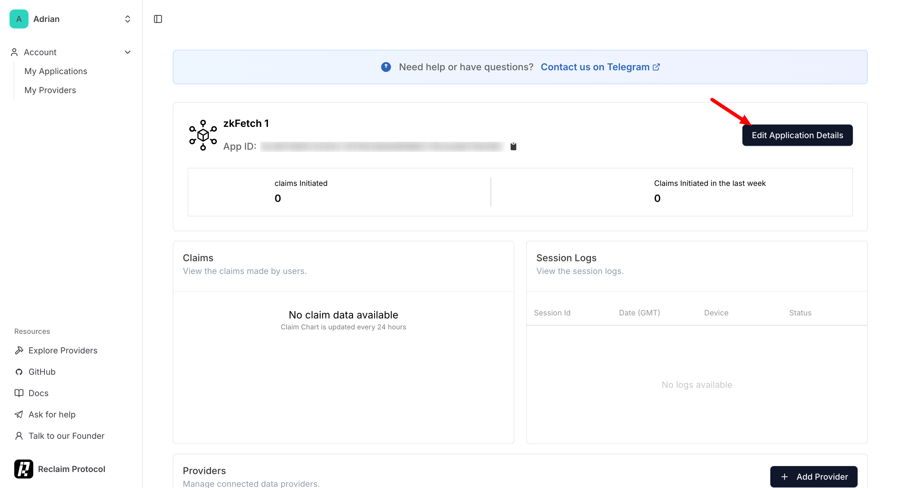

# Enabling Gasless Transactions with Treasury Contracts

Treasury contracts introduce an OAuth-like authentication flow fully on-chain, allowing developers to create intricate allowance systems that enable delegated authorization. This allows an account (the granter who is the end user) to grant permission to another account (the grantee, the treasury contract) to execute specific types of transactions on their behalf. These contracts also enable a gasless experience for end users via fee grants. This guide walks you through using the developer portal to deploy your app’s first treasury contract.


Each treasury contract deployment is designed for a single app. Think of it like setting up OAuth for your application, where your app requests access to data from the XION chain on behalf of the user, without accessing any private information.


## **Understanding Fee Grants and Authorizations**

Treasury contracts leverage two key modules to provide their core functionality: **Fee Grants** and **Authz**. These modules enable **gasless transactions** and **delegated authorization**, enhancing the user experience.

### **Fee Grants**

The **Fee Grant module** allows an account (**granter**) to cover gas fees for another account (**grantee**), making transactions **gasless** for the end user. This feature is particularly useful for **onboarding users**, as it removes the need for them to **hold native tokens** to pay for transaction fees.

#### **How Fee Grants Work?**

1. The **treasury contract holds a balance of XION tokens** to cover gas fees.
2. The **contract grants fee sponsorship** for specific transactions.
3. The **user (grantee) submits a transaction**, and the **treasury contract pays the gas fee automatically**.

#### **Key Benefits of Fee Grants**

* **Frictionless onboarding** – Users can interact with the app immediately without needing XION tokens.
* **Better user experience** – Reduces complexity and improves adoption for non-crypto-native users.
* **Controlled sponsorship** – apps can define limits on gas fee coverage.

### **Authorizations (Authz)**

The **Authz module** enables **delegated authorization**, allowing one account (**granter**) to grant another account (**grantee**) permission to execute specific transactions on its behalf.

#### **How Authz Works in Treasury Contracts?**

* **The user acts as the granter**, granting permission to the **treasury contract (grantee)** to execute transactions on their behalf.
* **The treasury contract defines allowed actions**, for exmple token transfers.
* **Users approve the treasury contract** to execute these actions on their behalf.
* **The app allows users to trigger transactions**, which the **treasury contract then executes on their behalf**.

#### **Key Benefits of Authz**

* **Security and control** – Users define exactly which actions the treasury contract can perform.
* **Automation** – Transactions can be executed without requiring constant user approval.
* **Efficiency** – Reduces manual signing and streamlines app interactions.

By combining **Fee Grants** and **Authz**, **Treasury Contracts** offer **a seamless and user-friendly blockchain experience**, eliminating gas fees while maintaining security and control over transaction execution.

## Developer Portal

We have developed a **Developer Portal** to provide resources that developers can leverage within their apps. The first feature available is the **creation and management of Treasury Contracts**. You can access the Developer Portal using the following links:

* **Testnet**: [https://dev.testnet.burnt.com](https://dev.testnet.burnt.com/)
* **Mainnet**: [https://dev.burnt.com](https://dev.burnt.com)

To perform any actions, you must **log in to the portal**. After logging in, you will be automatically redirected to the **Dashboard**, where you can create and manage your deployed Treasury Contracts.

### The Dashboard

The **Dashboard** displays all your deployed **Treasury Contracts**. Once you create a contract, it will appear in your list of active deployments.

#### **Important Note:**

* Contract details are **stored in your browser's local storage**.
* Switching **browsers or devices will not retain your deployed contract list**.

<figure><figcaption></figcaption></figure>

## Creating a Treasury Contract

To create a new **Treasury Contract**, follow these steps:

1. Click the **"New Treasury"** button located at the **top right corner** of the Dashboard.
2. A setup screen will appear, prompting you to configure the contract settings.

<figure><figcaption></figcaption></figure>

You must complete the required fields for each module:

* **Allowance Configuration:** At least **one fee grant** is required to enable gasless transactions.
* **Permissions:** At least **one authorization grant** must be set up to define transaction permissions.

In the next sections, we'll go through each module in more detail.

### **Allowance Configuration (**&#x46;ee Grant)

The **Fee Grant** section allows you to set up a mechanism to cover gas fees for user interactions within your app. There are three types of fee allowances available:

**1. Basic Allowance (`/cosmos.feegrant.v1beta1.BasicAllowance`)**

* Defines a **fixed spend limit per transaction**.
* Ideal for simple fee grants where users have a predefined gas budget.

**2. Periodic Allowance (`/cosmos.feegrant.v1beta1.PeriodicAllowance`)**

* Allows users to access the grant **at set intervals**.
* You can specify:
  * **Period duration** (time users must wait before reusing the grant).
  * **Spend limit per period** to control gas consumption.

**3. Allowed Message Allowance (`/cosmos.feegrant.v1beta1.AllowedMsgAllowance`)**

* Restricts the fee grant to cover **only specific transaction types**.
* You can apply either a **Basic Allowance** or **Periodic Allowance** to the specified transaction type.

#### **Configuring the Fee Grant**

1. **Enter a description** explaining what the grant will cover.
2. **Select the allowance type** (Basic, Periodic, or Allowed Message Allowance).
3. **Fill in the required fields** based on the selected allowance type.
4. Click **"Save"** to finalize and store the Fee Grant configuration.

Once saved, the Fee Grant settings will be applied, which you can see in the "T**reasury Instance Preview**":

<figure><figcaption></figcaption></figure>

### Permissions

This section allows you to define **transaction permissions (allowances)** that users must agree to before your app can execute actions on their behalf.

#### **Setting Up Authorization**

1. **Enter a Description**
   * Provide a **clear and concise description** explaining the purpose of the authorization.
   * This description will be shown to users when they click **"Allow"** after connecting their account.
2. **Select a Permission Type**
   * The **Permission** **Type** determines the kind of transactions your app will be authorized to perform.
   * **Example**: Selecting "`Execute on a smart contract`" allows your app to execute transactions on a smart contract on behalf of the user.
     * **Define Contract Execution Authorization**
       * **Select the authorization type** (currently, "`Contract execution authorization`" is the only option).
       * **Enter the contract address** that your app will interact with on behalf of the user.
     * **Set Transaction Limits (Optional)**
       * You can impose restrictions on:
         * **Total number of allowed contract calls**.
         * **Maximum fund spending limit**.
         * **Both call count and fund spending limits** for added security.
     * **Configure Message Filters**
       * **Allow all messages** – Grants permission to execute any message within the contract.
       * **Accepted message keys** – Specify which message types can be executed.
       * **Accepted raw messages** – Define precise message structures that can be processed.

Once configured, these settings define how your Treasury Contract interacts with users and enforces controlled transaction execution.

<figure><figcaption></figcaption></figure>

Once you've entered all the required information, click the **"Add contract grant"** button.

**Important Notes:**

* You can add **multiple Permissions**, allowing you to define different permissions for various interactions.

<figure><figcaption></figcaption></figure>

### Treasury Params

There are a few parameters that you can configure within your treasury contract instacne. Currently the parameters are limited to a **redirect URL** which is the URL users will be redirected to after successful login and **Icon URL** which will display this icon on the Abstraxion login screen.

These two parameters are required and so you need to fill in the values:

<figure><figcaption></figcaption></figure>

Once those parameters have been added you can scroll down to the bottom of the page and click the "**Create**" button to create your treasury contract instance. Once created, the contract will appear on the **Dashboard**.


**Fund the Treasury Contract**: Transfer **XION tokens** to the contract to ensure it can cover gas fees for fee grants.


## Editing a Treasury Contract

Once a Treasury contract is created, it will appear in the **Dashboard**. To edit it, simply click on the contract from the list, which will open a management screen.

<figure><figcaption></figcaption></figure>

### Withdraw Funds

To withdraw any funds sent to the Treasury contract:

1. Click the **"Withdraw Funds"** button.
2. A withdrawal screen will appear.
3. Enter the amount to withdraw which transfers funds from the Treasury contract back to the admin account.

<figure><figcaption></figcaption></figure>

### Update Params <a href="#radix-r14" id="radix-r14"></a>

To modify the parameters:

1. Click the **"Update Params"** button.
2. A configuration screen will load, allowing you to adjust relevant params.

<figure><figcaption></figcaption></figure>

### Edit Allowance

To edit the allowance:

1. Click the **"Edit"** button under the **Allowance** section.
2. This will open a screen where you can adjust the allowance parameters.

<figure><figcaption></figcaption></figure>

### Update and Add Permissions

To add a new permission click the "**Add New**" button.

<figure><figcaption></figcaption></figure>

A screen will open where you can add the new permission:

<figure><figcaption></figcaption></figure>

To edit a permission click the "**Edit**" button in the permission listing. A screen will open where you can edit the configuration:

<figure><figcaption></figcaption></figure>

If creating a new grant:

* Select a new **Type URL**.
* Enter the required field data.
* Click **"Save"** to create a new Grant Config.

### Delete a Grant Configs

If you need to remove a grant configuration from your treasury contract, you can easily do so through the grant config listing interface. The process involves selecting the grant you wish to delete, confirming the action.

To delete an existing grant configurations click the **trash bin** icon on the right of the listed permission.

<figure><figcaption></figcaption></figure>

**Confirm Deletion**

After clicking the trash bin icon, a popup window will appear with the title **"Remove grant config"**. The body of the popup will display the following message: _"**Are you sure you want to remove the \<type url of config> grant config?**"_

<figure><figcaption></figcaption></figure>

* **Cancel**: If you change your mind and do not want to delete the grant config, simply click the **Cancel** button to close the popup without making any changes.
* **Confirm**: If you're sure you want to delete the grant config, click the **Confirm** button.

After successful deletion, the page will reload and display a success message confirming that the grant configuration has been removed.

## Client-Side Implementation (React App)

To integrate gasless transactions and delegated authorizations using a Treasury contract in your app, follow this [**full guide**](../your-first-dapp/build-react-dapp-with-account-abstraxion.md).

You’ll need to configure the `AbstraxionProvider` by setting the Treasury contract in the config:

```typescript
const treasuryConfig = {
	treasury: `CONTRACT_ADDRESS`,
	// optional (only for mainnet)
	// rpcUrl: ``,
	// restUrl: ``
}


export default function RootLayout({
  children,
}: {
  children: React.ReactNode
}) {
  return (
    <html lang="en">
      <body className={inter.className}>
        <AbstraxionProvider
          config={treasuryConfig}>
          {children}
        </AbstraxionProvider>
      </body>
    </html>
  )
}
```

This configuration also determines the redirect URL users see after clicking **Connect** and before clicking **Allow** (as shown in the screenshot below).

<figure><figcaption></figcaption></figure>

While connecting their accounts, users will see a list of **Allowances** — this message is set during the Treasury contract’s creation by the developer while configuring the grant settings.

Once the user clicks **Allow**, the app:

1. **Creates Grant permissions**
2. **Deploys a Fee Grant** on behalf of the user.

<figure><figcaption></figcaption></figure>

Whenever your app executes a transaction using `.execute`, make sure the **granter** in the fee configuration (4th parameter) is set to the Treasury contract’s address:


If you modify the app to use Treasury contracts, ensure that all users **log out and reconnect** to apply the new settings.


```typescript
return client.execute(
    sender,
    contract,
    msg,
    {
      amount: [{ amount: "1", denom: "uxion" }],
      gas: "500000",
      granter: TREASURY.treasury
    },
    "",
    []
  );
```


If you have any questions or encounter issues, feel free to ask in our [**Telegram Developer Group**](https://t.me/+SC47NRhVz9Q2MDg0) or on [**Discord**](https://discord.com/invite/burnt) in our [**Dev Chat channel**](https://discord.com/channels/823953904512401469/1308977704586186762).

