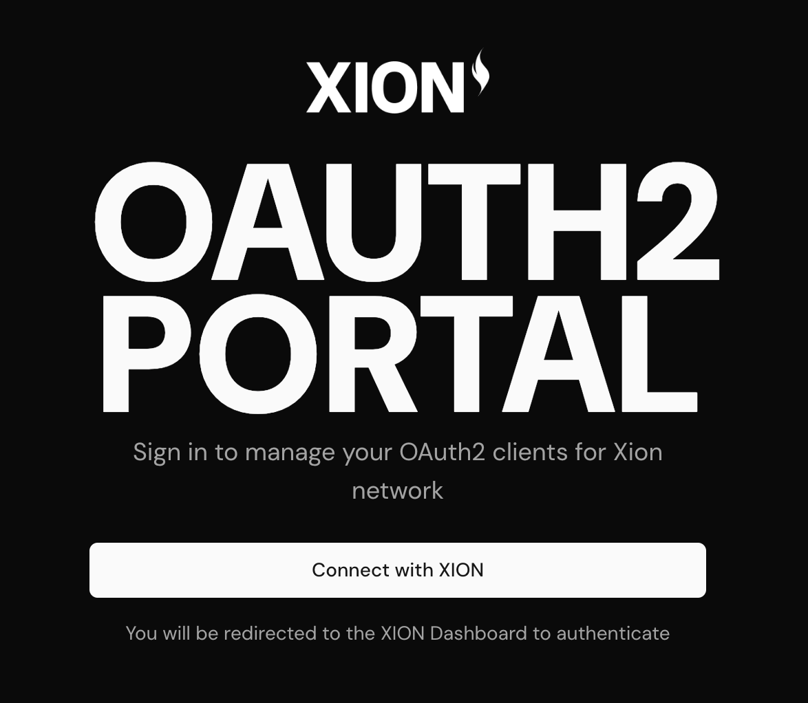
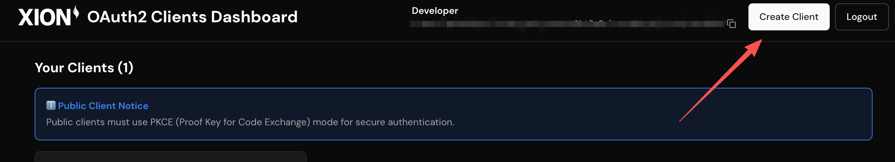
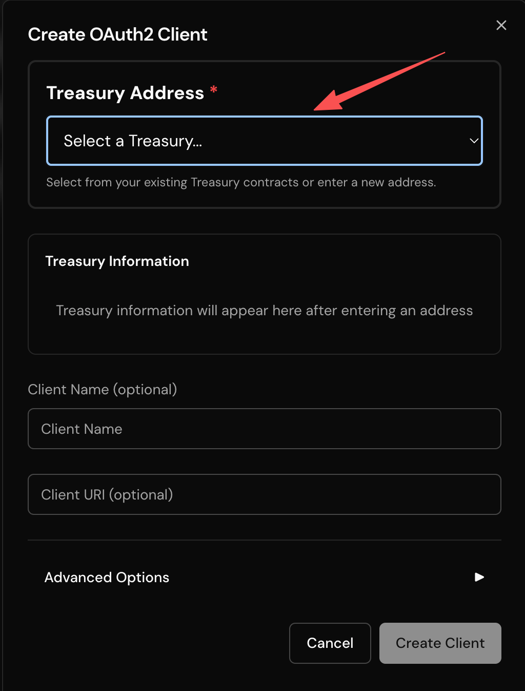
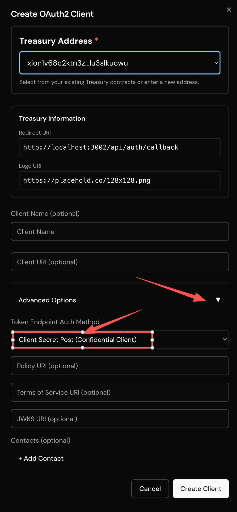
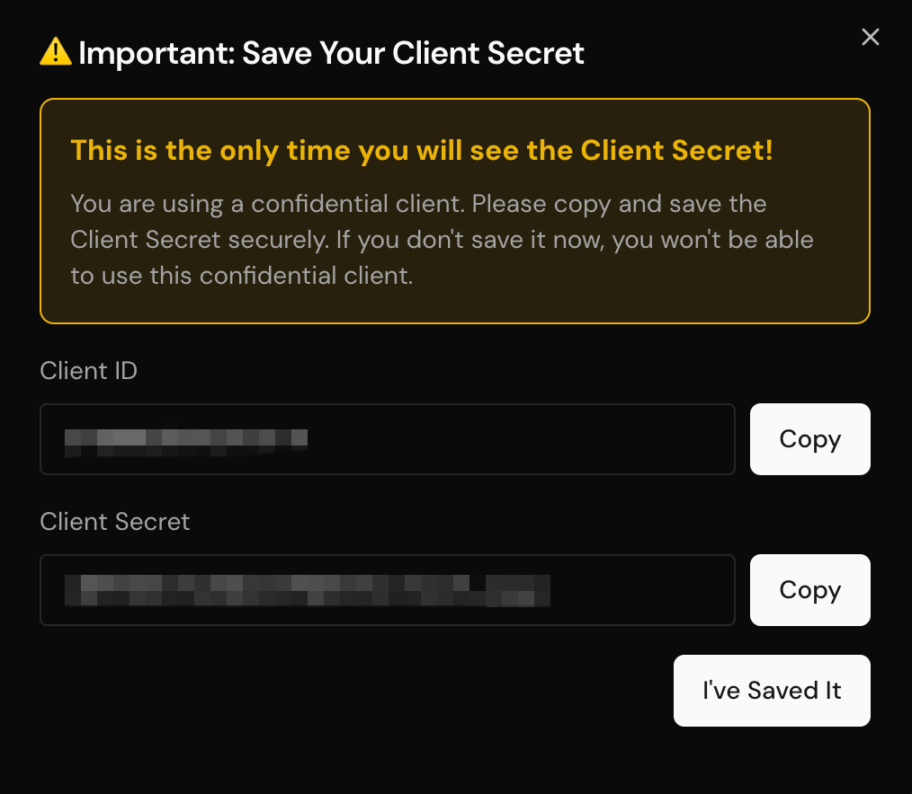

# Build an Xion OAuth2 Application

This guide provides a comprehensive walkthrough for integrating Xion into your application by OAuth2 authentication. By following this guide, you'll enable secure and efficient user authentication, leveraging the OAuth2 protocol to provide a Web2-style experience with blockchain capabilities.

A fully functional demo of OAuth2 integration is available in the [Xion OAuth2 App Demo](https://github.com/burnt-labs/xion-oauth2-app-demo) repository.

## 1. Understanding OAuth2 and Its Benefits

OAuth 2.0 is an industry-standard protocol for authorization, designed to provide specific authorization flows for web applications, desktop applications, mobile phones, and living room devices. The specification and its extensions are being developed within the IETF OAuth Working Group. For more information about OAuth 2.0, visit [oauth.net/2/](https://oauth.net/2/).

**Benefits of OAuth2 Integration with Xion:**

* **No Wallet Management**: Eliminates the complexity of wallet installation, seed phrase management, and transaction signing for end users
* **Web2 User Experience**: Users can authenticate using familiar Web2 methods (social logins, email, passkeys) without needing to manage blockchain wallets or private keys
* **Secure Token-Based Authentication**: Uses industry-standard OAuth2 tokens for secure API access without exposing user credentials
* **Gasless Transactions**: Leverages Treasury contracts to enable gasless transactions, removing the need for users to hold native tokens
* **Delegated Authorization**: Allows applications to execute transactions on behalf of users with explicit permissions
* **Scalability**: Facilitates integration with multiple services and platforms, promoting interoperability

Xion OAuth2 currently supports the **Authorization Code flow** with **PKCE (Proof Key for Code Exchange)** for enhanced security. This flow is recommended for both public and confidential clients.


**OAuth2 Flow Support**: Xion OAuth2 currently only supports the Authorization Code flow. Refresh token functionality is not yet available, so applications should handle token expiration by re-initiating the authorization flow when needed.


## 2. Prerequisites - Treasury Contract Setup

Before integrating OAuth2 with Xion Auth, you must first deploy and configure a **Treasury Contract**. The Treasury contract manages gasless transactions and permission grants, which are essential for the OAuth2 flow.

For detailed instructions on deploying a Treasury contract, refer to the Treasury Contracts Documentation.

### 2.1. Critical Treasury Configuration Requirements

When configuring your Treasury contract, there are two **critical requirements** for OAuth2 integration:

#### 2.1.1. Redirect URI Configuration

The **`redirect_uri`** parameter configured in your Treasury contract **MUST exactly match** the redirect URI used in your OAuth2 application. This redirect URI is where users will be redirected after successful authentication.

<figure><figcaption><p>Treasury contract configuration showing redirect URI</p></figcaption></figure>

**Example:**

* If your OAuth2 app uses `http://localhost:3000/callback` as the redirect URI
* Your Treasury contract's redirect URI must also be set to `http://localhost:3000/callback`

#### 2.1.2. OAuth2 App Toggle

You **MUST enable the "IS OAUTH2 APP" toggle** in the Treasury contract's Update Params section. This setting indicates that the Treasury contract is being used for OAuth2 authentication.

<figure><figcaption><p>Update Params dialog showing the IS OAUTH2 APP toggle</p></figcaption></figure>

**To enable the OAuth2 toggle:**

1. Navigate to your Treasury contract in the [Xion Developer Portal](https://dev.testnet.burnt.com/)
2. Click the **"Update Params"** button
3. Enable the **"IS OAUTH2 APP"** toggle switch
4. Save the changes


**OAuth2 Toggle Required**: Without enabling the "IS OAUTH2 APP" toggle, users will see redirect URI mismatch warnings when attempting to authenticate, even if the redirect URIs match correctly.


#### 2.1.3. Treasury Permissions and OAuth2 Transactions

The permissions (grant configs) you define in your Treasury contract determine which types of transactions can be executed through the OAuth2 API. **Only message types that are explicitly authorized in your Treasury contract's permissions can be used in OAuth2 transaction requests.**

For example:

* If your Treasury only has permission for `MsgSend` (token transfers), you can only send tokens via OAuth2 Protected API
* If your Treasury has permission for `MsgExecuteContract`, you can execute smart contract calls via OAuth2 Protected API
* You can configure multiple permissions to allow different transaction types

For more information on configuring Treasury permissions, see the Treasury Contracts Documentation.

## 3. Creating OAuth2 Clients

Once your Treasury contract is configured, you can create OAuth2 clients in the **XION OAuth2 Portal**. The portal allows you to manage OAuth2 clients that will authenticate users and access protected APIs.

### 3.1. Accessing the OAuth2 Portal

* **Testnet**: [https://oauth2.testnet.burnt.com/](https://oauth2.testnet.burnt.com/)
* **Mainnet**: (Available when mainnet is launched)

<figure><figcaption><p>OAuth2 Portal login screen</p></figcaption></figure>

To access the portal, click **"Connect with XION"** and authenticate using your Xion account. After authentication, you'll be redirected to the OAuth2 Clients Dashboard.

### 3.2. Creating a New OAuth2 Client

1. **Navigate to the Dashboard**

   After logging in, you'll see the OAuth2 Clients Dashboard showing all your created clients.

   <figure><figcaption><p>OAuth2 Clients Dashboard with Create Client button</p></figcaption></figure>

2. **Click "Create Client"**

   Click the **"Create Client"** button located in the top right corner of the dashboard.

3. **Configure Client Settings**

    The client creation form will appear.&#x20;

    <figure><figcaption><p>OAuth2 Client creation form</p></figcaption></figure>

    **You need to complete the following fields:**

    * **Treasury Address**: Select a Treasury contract from your existing deployments or enter a new Treasury address. The redirect URI from this Treasury will be used as your OAuth2 redirect URI.
    * **Client Name** (optional): A descriptive name for your application. If not provided, the name of this client will be untitled.
    * **Client URI** (optional): Your application's homepage URL

   **Default Configuration:**

   * By default, clients are created as **Public Clients with PKCE** enabled, which is suitable for frontend applications.

4. **Advanced Options - Confidential Client**

   If you're building a backend application and need a **Confidential Client**, click to expand the **"Advanced Options"** section.

    <figure><figcaption><p>Advanced Options showing Confidential Client selection</p></figcaption></figure>

   In the Advanced Options:

   * **Token Endpoint Auth Method**: Select **"Client Secret Post (Confidential Client)"** to create a confidential client
   * You can also configure optional fields like Policy URI, Terms of Service URI, and JWKS URI

5. **Create the Client**

   Click the **"Create Client"** button to create your OAuth2 client.

6. **Save Client Credentials**

   If you created a **Confidential Client**, a dialog will appear showing your **Client ID** and **Client Secret**.

<figure><figcaption><p>Client Secret display dialog - save this immediately</p></figcaption></figure>


**Important: Save Your Client Secret**: For Confidential Clients, the Client Secret is displayed **only once** during client creation. You must copy and save it securely immediately. If you lose the Client Secret, you'll need to create a new client.


### 3.3. Understanding Client Types

#### 3.3.1. Type 1: Public Client

**Use Case**: Frontend applications (React, Vue, Angular, etc.) running in the browser

**Characteristics:**

* No `client_secret` required
* **Must use PKCE** (Proof Key for Code Exchange) for security
* Token exchange happens in the browser
* Suitable for Single Page Applications (SPAs) and mobile apps

**Security**: PKCE provides security equivalent to using a client secret, making it safe for public clients.

#### 3.3.2. Type 2: Confidential Client

**Use Case**: Backend applications (Node.js, Python, etc.) with server-side token exchange

**Characteristics:**

* Requires `client_secret` for authentication
* Token exchange happens on the server
* More secure for backend applications
* Can optionally use PKCE in addition to client\_secret

**Security**: The `client_secret` is stored securely on the server and never exposed to the client.

## 4. OAuth2 Integration Examples

This section provides practical examples for integrating OAuth2 into your application. We'll cover the standard OAuth2 flow and provide complete examples for both frontend (Public Client) and backend (Confidential Client) implementations.

### 4.1 Standard OAuth2 Flow

The OAuth2 Authorization Code flow with PKCE follows these standard steps:

1. **Discovery**: Fetch OAuth2 server metadata
2. **Authorization**: Redirect user to authorization endpoint
3. **Callback**: Handle authorization code
4. **Token Exchange**: Exchange authorization code for access token
5. **API Access**: Use access token for protected API calls

#### Step 1: Discovery - Get OAuth2 Server Information

Before starting the OAuth2 flow, you need to discover the OAuth2 server's endpoints. This is done by fetching the `.well-known/oauth-authorization-server` endpoint:

```typescript
async function getOAuthServerInfo(): Promise<OAuthServerInfo> {
  const serverUrl = 'https://oauth2.testnet.burnt.com/'
  const response = await fetch(
    `${serverUrl}/.well-known/oauth-authorization-server`
  )
  if (!response.ok) {
    throw new Error('Failed to fetch OAuth server info')
  }
  return response.json()
}
```

The response includes:

* `issuer`: The OAuth2 server identifier
* `authorization_endpoint`: URL for the authorization endpoint
* `token_endpoint`: URL for the token exchange endpoint
* `scopes_supported`: Available OAuth2 scopes

#### Step 2: Authorization - Build Authorization URL

Build the authorization URL with standard OAuth2 parameters:

**For Public Clients (with PKCE):**

```typescript
// Generate PKCE code verifier and challenge
const codeVerifier = generateCodeVerifier() // 32-byte random string, base64url encoded
const codeChallenge = await generateCodeChallenge(codeVerifier) // SHA256 hash of verifier

// Generate state for CSRF protection
const state = generateRandomString()

// Build authorization URL
const authUrl = new URL(serverInfo.authorization_endpoint)
authUrl.searchParams.set('client_id', clientId)
authUrl.searchParams.set('redirect_uri', redirectUri)
authUrl.searchParams.set('response_type', 'code')
authUrl.searchParams.set('code_challenge', codeChallenge)
authUrl.searchParams.set('code_challenge_method', 'S256')
authUrl.searchParams.set('scope', 'xion:transactions:submit')
authUrl.searchParams.set('state', state)

// Redirect user to authorization URL
window.location.href = authUrl.toString()
```

**For Confidential Clients:**

```typescript
// Generate state for CSRF protection
const state = generateRandomString()

// Build authorization URL (PKCE optional for confidential clients)
const authUrl = new URL(serverInfo.authorization_endpoint)
authUrl.searchParams.set('client_id', clientId)
authUrl.searchParams.set('redirect_uri', redirectUri)
authUrl.searchParams.set('response_type', 'code')
authUrl.searchParams.set('scope', 'xion:transactions:submit')
authUrl.searchParams.set('state', state)

// Redirect user to authorization URL
window.location.href = authUrl.toString()
```

**OAuth2 Authorization Parameters:**

* `client_id`: Your OAuth2 client ID
* `redirect_uri`: Must match the redirect URI configured in your Treasury contract
* `response_type`: Always `"code"` for Authorization Code flow
* `code_challenge`: (Public Clients) Base64url-encoded SHA256 hash of code\_verifier
* `code_challenge_method`: (Public Clients) Always `"S256"` for SHA256
* `scope`: XION's OAuth2 Protected API scopes (e.g., `"xion:transactions:submit"`)
* `state`: Random string for CSRF protection

#### Step 3: Callback - Handle Authorization Code

After the user authorizes your application, they'll be redirected back to your `redirect_uri` with an authorization code:

```typescript
// Extract code and state from URL
const urlParams = new URLSearchParams(window.location.search)
const code = urlParams.get('code')
const state = urlParams.get('state')
const error = urlParams.get('error')

if (error) {
  // Handle authorization error
  console.error('Authorization error:', error)
  return
}

if (!code) {
  // Handle missing code
  console.error('No authorization code received')
  return
}

// Verify state parameter (CSRF protection)
const storedState = sessionStorage.getItem('oauth_state')
if (state !== storedState) {
  throw new Error('Invalid state parameter. Possible CSRF attack.')
}
```

#### Step 4: Token Exchange - Exchange Code for Access Token

Exchange the authorization code for an access token:

**For Public Clients (with PKCE):**

```typescript
async function exchangeCodeForToken(code: string): Promise<TokenInfo> {
  const serverInfo = await getOAuthServerInfo()
  const codeVerifier = sessionStorage.getItem('oauth_code_verifier') // Retrieved from Step 2

  const response = await fetch(serverInfo.token_endpoint, {
    method: 'POST',
    headers: {
      'Content-Type': 'application/json',
    },
    body: JSON.stringify({
      grant_type: 'authorization_code',
      code: code,
      redirect_uri: redirectUri,
      code_verifier: codeVerifier, // PKCE: code verifier replaces client_secret
      client_id: clientId,
    }),
  })

  if (!response.ok) {
    throw new Error('Token exchange failed')
  }

  const tokens = await response.json()
  return {
    accessToken: tokens.access_token,
    expiresIn: tokens.expires_in,
    tokenType: tokens.token_type,
  }
}
```

**For Confidential Clients(Use POST body, without PKCE):**

```typescript
async function exchangeCodeForToken(code: string): Promise<TokenInfo> {
  const serverInfo = await getOAuthServerInfo()

  const response = await fetch(serverInfo.token_endpoint, {
    method: 'POST',
    headers: {
      'Content-Type': 'application/json',
    },
    body: JSON.stringify({
      grant_type: 'authorization_code',
      code: code,
      redirect_uri: redirectUri, // Must match the redirect_uri used in the authorization request
      client_id: clientId,
      client_secret: clientSecret, // Stored securely on server
    }),
  })

  if (!response.ok) {
    throw new Error('Token exchange failed')
  }

  const tokens = await response.json()
  return {
    accessToken: tokens.access_token,
    expiresIn: tokens.expires_in,
    tokenType: tokens.token_type,
  }
}
```

**OAuth2 Token Request Parameters:**

* `grant_type`: Always `"authorization_code"` for this flow
* `code`: The authorization code received from the callback
* `redirect_uri`: Must match the redirect\_uri used in the authorization request
* `client_id`: Your OAuth2 client ID
* `client_secret`: (Confidential Clients only) Your client secret
* `code_verifier`: (Public Clients with PKCE) The original code verifier. Should be used in the token exchange request for Public Clients with PKCE.

### 4.2 Frontend Public Client Example

This example demonstrates a complete frontend OAuth2 integration using a Public Client with PKCE.

Example repository: [xion-oauth2-app-demo/examples/frontend+public\_client](https://github.com/burnt-labs/xion-oauth2-app-demo/tree/main/examples/frontend+public_client)

Following are some of major OAuth2 utility functions for the frontend Public Client example.

**Complete OAuth2 Utility Functions:**

```typescript
// utils/oauth.ts
import type { TokenInfo, OAuthServerInfo } from '@/types'

const STORAGE_KEY_TOKEN = 'xion_oauth_token'
const STORAGE_KEY_CODE_VERIFIER = 'xion_oauth_code_verifier'
const STORAGE_KEY_STATE = 'xion_oauth_state'

export function getOAuthServerUrl(): string {
  return import.meta.env.VITE_XION_OAUTH2_SERVER_URL || 'https://oauth2.testnet.burnt.com/'
}

export function getClientId(): string {
  return import.meta.env.VITE_XION_OAUTH2_CLIENT_ID || ''
}

export function getRedirectUri(): string {
  return `${window.location.origin}/callback`
}

export async function getOAuthServerInfo(): Promise<OAuthServerInfo> {
  const serverUrl = getOAuthServerUrl()
  const response = await fetch(
    `${serverUrl}/.well-known/oauth-authorization-server`
  )
  if (!response.ok) {
    throw new Error('Failed to fetch OAuth server info')
  }
  return response.json()
}

// Generate PKCE code verifier (32 random bytes, base64url encoded)
export function generateCodeVerifier(): string {
  const array = new Uint8Array(32)
  crypto.getRandomValues(array)
  return btoa(String.fromCharCode(...array))
    .replace(/\+/g, '-')
    .replace(/\//g, '_')
    .replace(/=/g, '')
}

// Generate PKCE code challenge (SHA256 hash of verifier, base64url encoded)
export async function generateCodeChallenge(verifier: string): Promise<string> {
  const encoder = new TextEncoder()
  const data = encoder.encode(verifier)
  const hash = await crypto.subtle.digest('SHA-256', data)
  return btoa(String.fromCharCode(...new Uint8Array(hash)))
    .replace(/\+/g, '-')
    .replace(/\//g, '_')
    .replace(/=/g, '')
}

// Start OAuth2 authorization flow
export async function startAuthorization(): Promise<void> {
  const serverInfo = await getOAuthServerInfo()
  const clientId = getClientId()
  const redirectUri = getRedirectUri()

  if (!clientId) {
    throw new Error('Client ID is not configured')
  }

  // Generate PKCE code verifier and challenge
  const codeVerifier = generateCodeVerifier()
  sessionStorage.setItem(STORAGE_KEY_CODE_VERIFIER, codeVerifier)

  const codeChallenge = await generateCodeChallenge(codeVerifier)

  // Generate state parameter for CSRF protection
  const state = generateCodeVerifier()
  sessionStorage.setItem(STORAGE_KEY_STATE, state)

  // Build authorization URL with PKCE parameters
  const authUrl = new URL(serverInfo.authorization_endpoint)
  authUrl.searchParams.set('client_id', clientId)
  authUrl.searchParams.set('redirect_uri', redirectUri)
  authUrl.searchParams.set('response_type', 'code')
  authUrl.searchParams.set('code_challenge', codeChallenge)
  authUrl.searchParams.set('code_challenge_method', 'S256')
  authUrl.searchParams.set('scope', 'xion:transactions:submit')
  authUrl.searchParams.set('state', state)

  window.location.href = authUrl.toString()
}

// Exchange authorization code for access token
export async function exchangeCodeForToken(
  code: string,
  state?: string
): Promise<TokenInfo> {
  const serverInfo = await getOAuthServerInfo()
  const clientId = getClientId()
  const redirectUri = getRedirectUri()

  // Retrieve PKCE code verifier from session storage
  const codeVerifier = sessionStorage.getItem(STORAGE_KEY_CODE_VERIFIER)
  if (!codeVerifier) {
    throw new Error('Code verifier not found. Please restart the authorization flow.')
  }

  // Verify state parameter for CSRF protection
  if (state) {
    const storedState = sessionStorage.getItem(STORAGE_KEY_STATE)
    if (!storedState || storedState !== state) {
      sessionStorage.removeItem(STORAGE_KEY_CODE_VERIFIER)
      sessionStorage.removeItem(STORAGE_KEY_STATE)
      throw new Error('Invalid state parameter. Possible CSRF attack.')
    }
  }

  // Exchange authorization code for access token using PKCE
  const response = await fetch(serverInfo.token_endpoint, {
    method: 'POST',
    headers: {
      'Content-Type': 'application/x-www-form-urlencoded',
    },
    body: new URLSearchParams({
      grant_type: 'authorization_code',
      code,
      redirect_uri: redirectUri,
      code_verifier: codeVerifier, // PKCE: code verifier replaces client_secret
      client_id: clientId,
    }),
  })

  if (!response.ok) {
    const error = await response.json().catch(() => ({ error: 'Token exchange failed' }))
    sessionStorage.removeItem(STORAGE_KEY_CODE_VERIFIER)
    sessionStorage.removeItem(STORAGE_KEY_STATE)
    throw new Error(error.error || 'Token exchange failed')
  }

  const tokens = await response.json()
  const expiresIn = tokens.expires_in || 3600
  const expiration = Date.now() + expiresIn * 1000

  const tokenInfo: TokenInfo = {
    accessToken: tokens.access_token,
    expiresIn,
    expiration,
    tokenType: tokens.token_type,
  }

  saveTokenInfo(tokenInfo)

  // Clean up PKCE and state from session storage
  sessionStorage.removeItem(STORAGE_KEY_CODE_VERIFIER)
  sessionStorage.removeItem(STORAGE_KEY_STATE)

  return tokenInfo
}

// Token storage utilities
export function saveTokenInfo(tokenInfo: TokenInfo): void {
  localStorage.setItem(STORAGE_KEY_TOKEN, tokenInfo.accessToken)
  localStorage.setItem(STORAGE_KEY_EXPIRATION, tokenInfo.expiration.toString())
}

export function getTokenInfo(): TokenInfo | null {
  const accessToken = localStorage.getItem(STORAGE_KEY_TOKEN)
  const expiration = localStorage.getItem(STORAGE_KEY_EXPIRATION)

  if (!accessToken || !expiration) {
    return null
  }

  const expirationTime = parseInt(expiration, 10)
  if (Date.now() >= expirationTime) {
    clearTokenInfo()
    return null
  }

  const expiresIn = Math.floor((expirationTime - Date.now()) / 1000)
  return {
    accessToken,
    expiration: expirationTime,
    expiresIn: expiresIn > 0 ? expiresIn : 0,
  }
}

export function clearTokenInfo(): void {
  localStorage.removeItem(STORAGE_KEY_TOKEN)
  localStorage.removeItem(STORAGE_KEY_EXPIRATION)
}
```

**Callback Component Example(Frontend Public Client):**

```typescript
// components/Callback.tsx
import { useEffect, useState } from 'react'
import { useNavigate, useSearchParams } from 'react-router-dom'
import { exchangeCodeForToken } from '@/utils/oauth'

export function Callback() {
  const [searchParams] = useSearchParams()
  const navigate = useNavigate()
  const [error, setError] = useState<string | null>(null)
  const [isLoading, setIsLoading] = useState(true)

  useEffect(() => {
    const handleCallback = async () => {
      const code = searchParams.get('code')
      const state = searchParams.get('state')
      const errorParam = searchParams.get('error')

      if (errorParam) {
        setError(`Authorization error: ${errorParam}`)
        setIsLoading(false)
        return
      }

      if (!code) {
        setError('No authorization code received')
        setIsLoading(false)
        return
      }

      try {
        await exchangeCodeForToken(code, state || undefined)
        navigate('/dashboard', { replace: true })
      } catch (err) {
        setError(err instanceof Error ? err.message : 'Failed to exchange code for token')
        setIsLoading(false)
      }
    }

    handleCallback()
  }, [searchParams, navigate])

  if (isLoading) {
    return <div>Processing authorization...</div>
  }

  if (error) {
    return <div>Error: {error}</div>
  }

  return null
}
```

**Key Points for Frontend Implementation:**

1. **PKCE is Required**: Public clients must use PKCE for security. The code verifier is generated client-side and never sent to the server until token exchange.
2. **State Parameter**: Always use a state parameter for CSRF protection. Store it in sessionStorage and verify it in the callback.
3. **Token Storage**: Store access tokens securely. Use localStorage for persistence, but be aware of XSS risks. Consider using httpOnly cookies for production applications.
4. **Token Expiration**: Check token expiration before making API calls and re-authenticate when tokens expire.

### 4.3 Backend Confidential Client Example

This example demonstrates a complete backend OAuth2 integration using a Confidential Client with server-side token exchange.

Example repository: [xion-oauth2-app-demo/examples/backend+confidential\_client](https://github.com/burnt-labs/xion-oauth2-app-demo/tree/main/examples/backend+confidential_client)

Following are some of major OAuth2 utility functions for the backend Confidential Client example.

**OAuth2 Configuration (Server-side):**

```typescript
// lib/oauth-config.ts
export function getOAuthServerUrl(): string {
  return process.env.XION_OAUTH2_SERVER_URL || 'https://oauth2.testnet.burnt.com/'
}

export function getClientId(): string {
  const clientId = process.env.XION_OAUTH2_CLIENT_ID
  if (!clientId) {
    throw new Error('XION_OAUTH2_CLIENT_ID is not configured')
  }
  return clientId
}

export function getClientSecret(): string {
  const clientSecret = process.env.XION_OAUTH2_CLIENT_SECRET
  if (!clientSecret) {
    throw new Error('XION_OAUTH2_CLIENT_SECRET is not configured')
  }
  return clientSecret
}

export function getRedirectUri(req?: NextApiRequest): string {
  const appUrl = getAppBaseUrl(req) // Your application base URL
  return `${appUrl}/api/auth/callback`
}

export async function getOAuthServerInfo(): Promise<OAuthServerInfo> {
  const serverUrl = getOAuthServerUrl()
  const response = await fetch(
    `${serverUrl}/.well-known/oauth-authorization-server`
  )
  if (!response.ok) {
    throw new Error('Failed to fetch OAuth server info')
  }
  return response.json()
}
```

**Authorization Endpoint (Initiate OAuth2 Flow):**

```typescript
// pages/api/auth/login.ts (Next.js API route example)
import type { NextApiRequest, NextApiResponse } from 'next'
import { getOAuthServerInfo, getClientId, getRedirectUri } from '@/lib/oauth-config'

export default async function handler(
  req: NextApiRequest,
  res: NextApiResponse
) {
  if (req.method !== 'GET') {
    return res.status(405).json({ error: 'Method not allowed' })
  }

  try {
    const serverInfo = await getOAuthServerInfo()
    const clientId = getClientId()
    const redirectUri = getRedirectUri(req)

    // Generate state parameter for CSRF protection
    const state = generateRandomString()

    // Store state in httpOnly cookie
    res.setHeader('Set-Cookie', [
      `oauth_state=${state}; Path=/; HttpOnly; SameSite=Lax; Max-Age=600`,
    ])

    // Build authorization URL
    const authUrl = new URL(serverInfo.authorization_endpoint)
    authUrl.searchParams.set('client_id', clientId)
    authUrl.searchParams.set('redirect_uri', redirectUri)
    authUrl.searchParams.set('response_type', 'code')
    authUrl.searchParams.set('scope', 'xion:transactions:submit')
    authUrl.searchParams.set('state', state)

    // Redirect to authorization endpoint
    res.redirect(authUrl.toString())
  } catch (error) {
    console.error('Login error:', error)
    res.status(500).json({ error: 'Failed to initiate OAuth flow' })
  }
}
```

**Callback Endpoint (Token Exchange):**

```typescript
// pages/api/auth/callback.ts (Next.js API route example)
import type { NextApiRequest, NextApiResponse } from 'next'
import {
  getOAuthServerInfo,
  getClientId,
  getClientSecret,
  getRedirectUri,
} from '@/lib/oauth-config'

export default async function handler(
  req: NextApiRequest,
  res: NextApiResponse
) {
  if (req.method !== 'GET') {
    return res.status(405).json({ error: 'Method not allowed' })
  }

  const { code, state, error, error_description } = req.query

  // Handle OAuth errors
  if (error) {
    return res.redirect(
      `/?error=${encodeURIComponent(error as string)}&error_description=${encodeURIComponent(
        (error_description as string) || ''
      )}`
    )
  }

  if (!code) {
    return res.redirect('/?error=no_code')
  }

  // Verify state parameter
  const storedState = req.cookies.oauth_state
  if (!storedState || storedState !== state) {
    res.setHeader('Set-Cookie', ['oauth_state=; Path=/; Max-Age=0'])
    return res.redirect('/?error=invalid_state')
  }

  try {
    const serverInfo = await getOAuthServerInfo()
    const clientId = getClientId()
    const clientSecret = getClientSecret()
    const redirectUri = getRedirectUri(req)

    // Exchange authorization code for access token
    const tokenResponse = await fetch(serverInfo.token_endpoint, {
      method: 'POST',
      headers: {
        'Content-Type': 'application/x-www-form-urlencoded',
      },
      body: new URLSearchParams({
        grant_type: 'authorization_code',
        code: code as string,
        redirect_uri: redirectUri,
        client_id: clientId,
        client_secret: clientSecret, // Confidential Client: uses client_secret
      }),
    })

    if (!tokenResponse.ok) {
      const errorData = await tokenResponse.json().catch(() => ({ error: 'Token exchange failed' }))
      throw new Error(errorData.error || 'Token exchange failed')
    }

    const tokens = await tokenResponse.json()
    const expiresIn = tokens.expires_in || 3600
    const expiration = Date.now() + expiresIn * 1000

    // Clear state cookie
    res.setHeader('Set-Cookie', ['oauth_state=; Path=/; Max-Age=0'])

    // Store token in httpOnly cookie or session
    res.setHeader('Set-Cookie', [
      `oauth_token=${tokens.access_token}; Path=/; HttpOnly; SameSite=Strict; Max-Age=${expiresIn}`,
    ])

    // Redirect to application
    res.redirect('/dashboard')
  } catch (error) {
    console.error('Callback error:', error)
    res.setHeader('Set-Cookie', ['oauth_state=; Path=/; Max-Age=0'])
    res.redirect(
      `/?error=${encodeURIComponent(
        error instanceof Error ? error.message : 'Token exchange failed'
      )}`
    )
  }
}
```

**Key Points for Backend Implementation:**

1. **Client Secret Security**: Never expose the `client_secret` to the client. Store it securely in environment variables and only use it server-side.
2. **State Verification**: Always verify the state parameter to prevent CSRF attacks. Store it in httpOnly cookies.
3. **Token Storage**: Store access tokens securely on the server. Use httpOnly cookies or server-side sessions.
4. **Error Handling**: Implement proper error handling for all OAuth2 flow steps and provide user-friendly error messages.

## 5. OAuth2 Protected APIs

Once you have an access token, you can use it to access protected OAuth2 APIs. These APIs allow you to interact with the XION blockchain on behalf of authenticated users.

### API Base URL

* **Testnet**: `https://oauth2.testnet.burnt.com/`
* **Mainnet**: (Available when mainnet is launched)

#### API Documentation

For complete API documentation with interactive examples, visit the [OAuth2 Protected API Documentation](https://oauth2.testnet.burnt.com/protected-api-docs).

#### Authentication

All protected API endpoints require authentication using a Bearer token in the `Authorization` header:

```typescript
headers: {
  'Authorization': `Bearer ${accessToken}`,
  'Content-Type': 'application/json',
}
```

### Available Endpoints

#### 1. Get Current User Information

**Endpoint**: `GET /api/v1/me`

Returns information about the currently authenticated user's MetaAccount.

**Request:**

```typescript
const response = await fetch('https://oauth2.testnet.burnt.com/api/v1/me', {
  headers: {
    'Authorization': `Bearer ${accessToken}`,
  },
})
const userInfo = await response.json()
```

**Response:**

```json
{
  "address": "xion1...",
  "account_number": "0",
  "sequence": "0"
}
```

#### 2. Submit Transaction

**Endpoint**: `POST /api/v1/transaction`

Submits a blockchain transaction on behalf of the authenticated user. The transaction messages must be constructed using protobuf-based types from `@burnt-labs/xion-types`.

**Request:**

```typescript
const response = await fetch('https://oauth2.testnet.burnt.com/api/v1/transaction', {
  method: 'POST',
  headers: {
    'Authorization': `Bearer ${accessToken}`,
    'Content-Type': 'application/json',
  },
  body: JSON.stringify({
    messages: [
      // Array of EncodeObject messages
      // See section 6 for message construction
    ],
  }),
})
const result = await response.json()
```

**Response:**

```json
{
  "txhash": "ABC123...",
  "height": "12345"
}
```

**Transaction Messages**: The `messages` array contains protobuf-encoded transaction messages. Each message must have a `typeUrl` and `value` field. See section 6: Building Transactions for details on constructing messages.

#### 3. Query Transaction Status

**Endpoint**: `GET /api/v1/transaction/{txHash}/status`

Queries the status of a previously submitted transaction.

**Request:**

```typescript
const txHash = 'ABC123...'
const response = await fetch(
  `https://oauth2.testnet.burnt.com/api/v1/transaction/${txHash}/status`,
  {
    headers: {
      'Authorization': `Bearer ${accessToken}`,
    },
  }
)
const status = await response.json()
```

**Response:**

```json
{
  "status": "success",
  "height": "12345",
  "txhash": "ABC123..."
}
```

#### 4. Simulate Transaction

**Endpoint**: `POST /api/v1/transaction/simulate`

Simulates a transaction execution without actually submitting it to the blockchain. Useful for estimating gas costs and validating transaction logic.

**Request:**

```typescript
const response = await fetch('https://oauth2.testnet.burnt.com/api/v1/transaction/simulate', {
  method: 'POST',
  headers: {
    'Authorization': `Bearer ${accessToken}`,
    'Content-Type': 'application/json',
  },
  body: JSON.stringify({
    messages: [
      // Array of EncodeObject messages
    ],
  }),
})
const simulation = await response.json()
```

**Response:**

```json
{
  "gas_info": {
    "gas_used": "50000",
    "gas_wanted": "100000"
  }
}
```

### Complete API Client Example

Here's a complete example of an API client with automatic token injection:

```typescript
// utils/api.ts
import axios, { AxiosInstance } from 'axios'
import { getTokenInfo, getOAuthServerUrl } from './oauth'

const createApiClient = (): AxiosInstance => {
  const apiClient = axios.create({
    baseURL: getOAuthServerUrl(),
    headers: {
      'Content-Type': 'application/json',
    },
  })

  // Add Bearer token to all requests
  apiClient.interceptors.request.use(
    (config) => {
      const tokenInfo = getTokenInfo()
      if (tokenInfo) {
        config.headers['Authorization'] = `Bearer ${tokenInfo.accessToken}`
      }
      return config
    },
    (error) => {
      return Promise.reject(error)
    }
  )

  return apiClient
}

export const apiClient = createApiClient()

export const accountApi = {
  getMe: async () => {
    const response = await apiClient.get('/api/v1/me')
    return response.data
  },
}

export const transactionApi = {
  sendTransaction: async (messages: any[]) => {
    const response = await apiClient.post('/api/v1/transaction', {
      messages,
    })
    return response.data
  },
  getTransactionStatus: async (txHash: string) => {
    const response = await apiClient.get(`/api/v1/transaction/${txHash}/status`)
    return response.data
  },
  simulateTransaction: async (messages: any[]) => {
    const response = await apiClient.post('/api/v1/transaction/simulate', {
      messages,
    })
    return response.data
  },
}
```

## 6. Building Transactions

To submit transactions via the OAuth2 API, you need to construct transaction messages using protobuf-based types from the `@burnt-labs/xion-types` package. These messages are then encoded and sent to the transaction API endpoint.

### Installing Xion Types

```bash
# npm
npm install @burnt-labs/xion-types

# pnpm
pnpm install @burnt-labs/xion-types

# yarn
yarn add @burnt-labs/xion-types

# bun
bun add @burnt-labs/xion-types
```

### Understanding Transaction Messages

Transaction messages in Xion use protobuf encoding. Each message has:

* **`typeUrl`**: The protobuf message type URL (e.g., `"/cosmos.bank.v1beta1.MsgSend"`)
* **`value`**: The protobuf-encoded message value

The OAuth2 Transaction API accepts an array of these messages in the `messages` field.

### Critical Relationship: Treasury Permissions


**Important**: Only message types that are explicitly authorized in your Treasury contract's permissions can be used in OAuth2 transaction requests.


For example:

* If your Treasury only has permission for `MsgSend`, you can only send tokens via OAuth2
* If your Treasury has permission for `MsgExecuteContract`, you can execute smart contract calls
* You can configure multiple permissions to allow different transaction types

Before constructing transaction messages, ensure the corresponding permissions are configured in your Treasury contract. See the Treasury Contracts Documentation for details on configuring permissions.

### Message Construction Examples

#### Sending Tokens (MsgSend)

Reference: [xion-types MsgSend Guide](https://github.com/burnt-labs/xion-types/blob/main/examples/typescript/GUIDE.md#msgsend-transfer-tokens)

```typescript
import { EncodeObject } from '@cosmjs/proto-signing'
import { MsgSend } from '@burnt-labs/xion-types/types/cosmos/bank/v1beta1/tx'

export function createSendTokensMessage(
  toAddress: string,
  amount: number,
  denom: string
): EncodeObject {
  return {
    typeUrl: MsgSend.typeUrl,
    value: MsgSend.fromPartial({
      toAddress: toAddress,
      amount: [
        {
          denom: denom,
          amount: amount.toString(),
        },
      ],
    }),
  }
}

// Usage in transaction API
const message = createSendTokensMessage(
  'xion1...', // recipient address
  1000000,    // amount (in base units, e.g., uxion)
  'uxion'     // denomination
)

const response = await transactionApi.sendTransaction([message])
```

#### Executing Smart Contracts (MsgExecuteContract)

Reference: [xion-types MsgExecuteContract Guide](https://github.com/burnt-labs/xion-types/blob/main/examples/typescript/GUIDE.md#msgexecutecontract-call-a-smart-contract)

```typescript
import { EncodeObject } from '@cosmjs/proto-signing'
import { MsgExecuteContract } from '@burnt-labs/xion-types/types/cosmwasm/wasm/v1/tx'

export function createExecuteContractMessage(
  sender: string,
  contract: string,
  msg: any, // Contract-specific message
  funds: Array<{ denom: string; amount: string }> = []
): EncodeObject {
  const executeMsg = MsgExecuteContract.fromPartial({
    sender: sender,
    contract: contract,
    msg: new TextEncoder().encode(JSON.stringify(msg)),
    funds: funds,
  })
  return MsgExecuteContract.toProtoMsg(executeMsg)
}

// Usage example: Execute a contract method
const message = createExecuteContractMessage(
  'xion1...',           // sender address (user's address)
  'xion1contract...',   // contract address
  {                     // contract message
    increment: {},
  },
  []                    // optional funds to send
)

const response = await transactionApi.sendTransaction([message])
```

#### Instantiating Contracts (MsgInstantiateContract)

Reference: [xion-types MsgInstantiateContract Guide](https://github.com/burnt-labs/xion-types/blob/main/examples/typescript/cosmwasm-v1-transaction-messages.ts#L177-L203)

```typescript
import { EncodeObject } from '@cosmjs/proto-signing'
import { MsgInstantiateContract } from '@burnt-labs/xion-types/types/cosmwasm/wasm/v1/tx'

export function createInstantiateContractMessage(
  sender: string,
  codeId: number,
  initMsg: any,
  label: string,
  funds: Array<{ denom: string; amount: string }> = []
): EncodeObject {
  const msg = MsgInstantiateContract.fromPartial({
    sender: sender,
    admin: sender, // Optional: address that can migrate contract
    codeId: BigInt(codeId),
    label: label,
    msg: new TextEncoder().encode(JSON.stringify(initMsg)),
    funds: funds,
  })
  return MsgInstantiateContract.toProtoMsg(msg)
}

// Usage example: Instantiate a CW20 token contract
const sender = 'xion1...'
const cw20InitMsg = {
  name: 'My Token',
  symbol: 'MTK',
  decimals: 6,
  initial_balances: [
    { address: sender, amount: '1000000' },
  ],
  mint: { minter: sender },
}

const message = createInstantiateContractMessage(
  sender,           // sender address
  510,                  // code ID
  cw20InitMsg,          // initialization message
  'My Token Contract',  // label
  []                    // optional funds
)

const response = await transactionApi.sendTransaction([message])
```

### Complete Transaction Example

Here's a complete example combining message construction and API usage:

```typescript
// utils/transactions.ts
import { EncodeObject } from '@cosmjs/proto-signing'
import { MsgSend } from '@burnt-labs/xion-types/types/cosmos/bank/v1beta1/tx'
import { transactionApi } from './api'

export function createSendTokensMessage(
  toAddress: string,
  amount: number,
  denom: string
): EncodeObject {
  return {
    typeUrl: MsgSend.typeUrl,
    value: MsgSend.fromPartial({
      toAddress: toAddress,
      amount: [
        {
          denom: denom,
          amount: amount.toString(),
        },
      ],
    }),
  }
}

// Usage in a component or function
async function sendTokens(toAddress: string, amount: number) {
  const message = createSendTokensMessage(toAddress, amount, 'uxion')
  const result = await transactionApi.sendTransaction([message])
  console.log('Transaction hash:', result.txhash)
  return result
}
```

### More Examples

For more transaction message construction examples, see:

* [xion-types TypeScript Examples](https://github.com/burnt-labs/xion-types/tree/main/examples/typescript)
* [xion-types TypeScript Guide](https://github.com/burnt-labs/xion-types/blob/main/examples/typescript/GUIDE.md)
* [OAuth2 App Demo - Transactions](https://github.com/burnt-labs/xion-oauth2-app-demo/blob/main/examples/frontend%2Bpublic_client/src/utils/transactions.ts)

## 7. Querying Blockchain Data

While the OAuth2 API provides endpoints for submitting transactions and querying transaction status, for general blockchain data queries (account balances, contract state, block information, etc.), you should use `@cosmjs/stargate` directly.

### Using CosmJS for Queries

CosmJS is the standard library for interacting with Cosmos SDK-based blockchains, including Xion. For detailed instructions on using CosmJS with Xion, refer to the Interact with XION via your Backend Service guide, specifically the "Querying the Blockchain" section.

### Installation

```bash
# npm
npm install @cosmjs/stargate

# pnpm
pnpm install @cosmjs/stargate

# yarn
yarn add @cosmjs/stargate

# bun
bun add @cosmjs/stargate
```

### Example: Querying Account Balance

```typescript
import { StargateClient } from '@cosmjs/stargate'

async function getBalance(address: string, denom: string = 'uxion') {
  const rpcUrl = process.env.XION_RPC_URL || 'https://rpc.xion-testnet-2.burnt.com:443'
  const client = await StargateClient.connect(rpcUrl)
  const balance = await client.getBalance(address, denom)
  return balance.amount
}
```

### Example: Querying Contract State

```typescript
import { StargateClient } from '@cosmjs/stargate'

async function queryContract(contractAddress: string, queryMsg: any) {
  const rpcUrl = process.env.XION_RPC_URL || 'https://rpc.xion-testnet-2.burnt.com:443'
  const client = await StargateClient.connect(rpcUrl)
  return await client.queryContractSmart(contractAddress, queryMsg)
}
```

### Why Use CosmJS for Queries?

* **Comprehensive Query Support**: CosmJS provides access to all Cosmos SDK query endpoints
* **No Authentication Required**: Queries don't require OAuth2 tokens
* **Standard Library**: Well-documented and widely used in the Cosmos ecosystem
* **Direct RPC Access**: Connects directly to Xion RPC nodes


**Future OAuth2 Query Endpoints**: The OAuth2 API may add query endpoints in future iterations based on product requirements. However, CosmJS already covers most use cases for querying blockchain data.


### RPC Endpoints

For a list of available RPC endpoints for each network, see the Public Endpoints and Resources documentation.

## Additional Resources

* **OAuth2 API Endpoint**: [https://oauth2.testnet.burnt.com/](https://oauth2.testnet.burnt.com/)
* **OAuth2 Portal**: [https://oauth2.testnet.burnt.com/](https://oauth2.testnet.burnt.com/) (for managing OAuth2 clients)
* **OAuth2 Protected API Documentation**: [https://oauth2.testnet.burnt.com/protected-api-docs](https://oauth2.testnet.burnt.com/protected-api-docs)
* **OAuth2 App Examples**: [https://github.com/burnt-labs/xion-oauth2-app-demo](https://github.com/burnt-labs/xion-oauth2-app-demo)
* **Xion Types Repository**: [https://github.com/burnt-labs/xion-types](https://github.com/burnt-labs/xion-types)
* **Xion Types TypeScript Guide**: [https://github.com/burnt-labs/xion-types/blob/main/examples/typescript/GUIDE.md](https://github.com/burnt-labs/xion-types/blob/main/examples/typescript/GUIDE.md)
* **Treasury Contracts Documentation**: Enabling Gasless Transactions with Treasury Contracts
* **Xion Developer Portal**: [https://dev.testnet.burnt.com/](https://dev.testnet.burnt.com/) (for managing Treasury contracts)


If you have any questions or encounter issues, feel free to ask in our [**Telegram Developer Group**](https://t.me/+SC47NRhVz9Q2MDg0) or on [**Discord**](https://discord.com/invite/burnt) in our [**Dev Chat channel**](https://discord.com/channels/823953904512401469/1308977704586186762).

