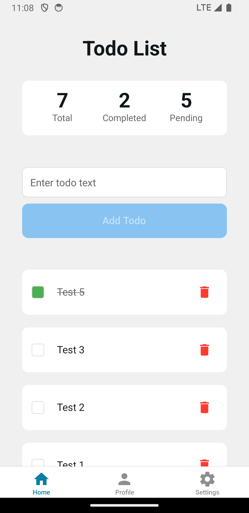
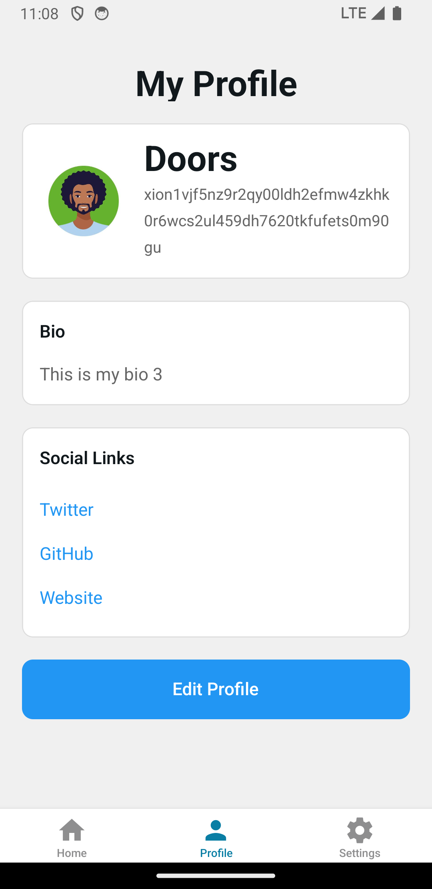
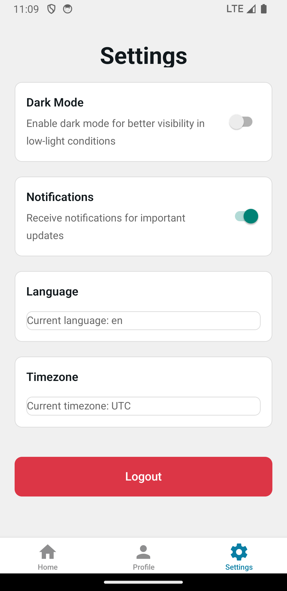

# Build a TODO Mobile App using the DocuStore Contract

To reduce the need for custom contract development and accelerate Web2 to Web3 migrations, we've created a contract that provides a **collection/document** based storage model, inspired by Firebase’s Firestore. It supports structured JSON data storage using a flexible key-value format and an a permission model.

This solution is a major upgrade from the original `user_map` contract by enabling:

* **Namespaced storage**: Data is organized into logical **collections** and **documents**.
* **Permissioned access**: Fine-grained control over who can **`create`**, **`update`**, **`delete`**, and **`read`** documents.
* **Role-based security**: Support for roles like "creator", "admin", and any custom roles.
* **Batch operations**: Write multiple documents in a single transaction.


## Todo App Data Structure

This todo app interacts with the **DocuStore** smart contract by organizing data into three main **collections**. Each collection stores structured documents with user-specific data.

### Todos Collection

```typescript
type Todo = {
  id: string;
  title: string;
  text: string;
  completed: boolean;
  created_at: string;
};
```

Each document in the `todos` collection represents an individual task. It includes basic task details and timestamps.

### Profiles Collection

```typescript
type Profile = {
  displayName: string;
  bio: string;
  avatar: string;
  socialLinks: {
    twitter?: string;
    github?: string;
    website?: string;
  };
};
```

The `profile` collection stores public facing user profile data such as name, bio, image for an avatar and social media links.

### Settings Collection

```javascript
interface Settings {
  darkMode: boolean;
  notifications: boolean;
  language: string;
  timezone: string;
}
```

The `settings` collection holds user preferences for customizing the application experience, including UI theme, notification toggles, and localization options.


## Building the Mobile App <a href="#building-the-frontend" id="building-the-frontend"></a>

We’ve created a [mobile app demo](https://github.com/burnt-labs/todo-app-expo-demo) built with [React Native](https://reactnative.dev/) and [Expo](https://expo.dev/) that includes all the necessary wiring to interact with the DocuStore smart contract. It demonstrates how users can connect their wallets, create todo items, update their profiles and app settings, and query their on-chain data.

### Manual Installation <a href="#manual-installation" id="manual-installation"></a>

1. You will first need to clone the repository:

```bash
git clone https://github.com/burnt-labs/todo-app-expo-demo.git
```

2. Install dependencies:

```bash
cd todo-app-expo-demo
npm install
```

3. Copy the **`.env.example`** file and name it **`.env.local`** and set the values with the information below:

```javascript
EXPO_PUBLIC_TODO_CONTRACT_ADDRESS="xion1svpts9q2ml4ahgc4tuu95w8cqzv988s6mf5mupt5kt56gvdnklks9hzar4"
EXPO_PUBLIC_TREASURY_CONTRACT_ADDRESS="xion1aza0jdzfc7g0u64k8qcvcxfppll0cjeer56k38vpshe3p26q5kzswpywp9"
EXPO_PUBLIC_RPC_ENDPOINT="https://rpc.xion-testnet-2.burnt.com:443"
EXPO_PUBLIC_REST_ENDPOINT="https://api.xion-testnet-2.burnt.com"
```

| Variable                                   | Description                                                                                                                                                             |
| ------------------------------------------ | ----------------------------------------------------------------------------------------------------------------------------------------------------------------------- |
| EXPO\_PUBLIC\_TREASURY\_CONTRACT\_ADDRESS  | Treasury contract instance used for gasless transactions and grantz authorization to execute transactions via the DocuStore smart contract instance on behalf of users. |
| EXPO\_PUBLIC\_DOCUSTORE\_CONTRACT\_ADDRESS | Address of the DocuStore smart contract instance.                                                                                                                       |
| EXPO\_PUBLIC\_RPC\_ENDPOINT                | RPC endpoint for Xion (default: `https://rpc.xion-testnet-2.burnt.com:443`)                                                                                             |
| EXPO\_PUBLIC\_REST\_ENDPOINT               | REST endpoint for Xion (default: `https://api.xion-testnet-2.burnt.com`)                                                                                                |


4. Build and launch the application:

To build and run the app, ensure your **emulator**, **simulator**, or **physical device** is running. Then, use one of the following commands based on your target platform to launch the App:



```sh
npx expo run:android
```



```sh
npx expo run:ios
```



You should see something like the following for the **Home** page:

<figure><figcaption></figcaption></figure>

Here is a glimpse of the **Profile** page:

<figure><figcaption></figcaption></figure>

This is the **Settings** page:

<figure><figcaption></figcaption></figure>

