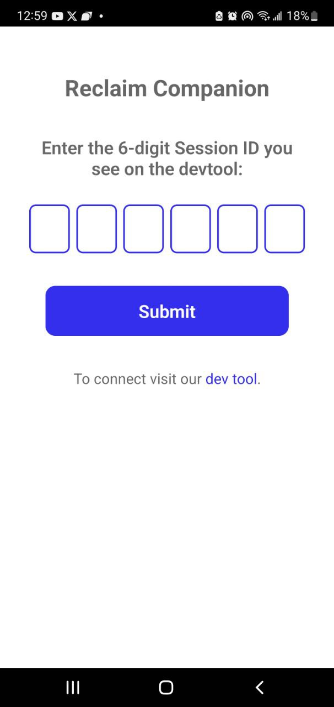
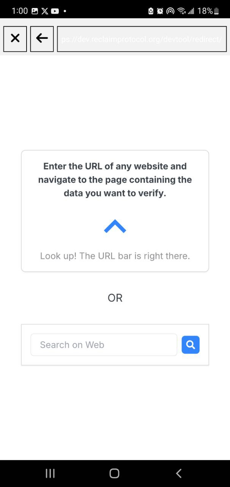
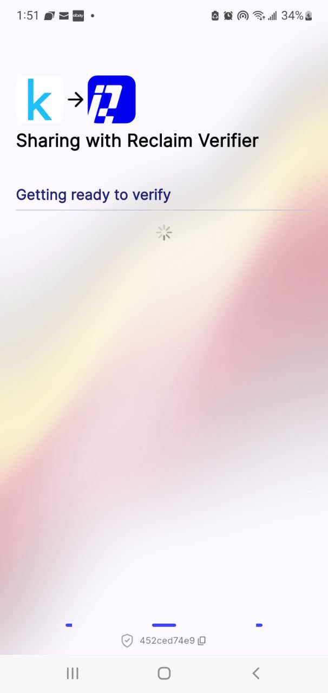

# How to Create a Custom Reclaim zkTLS Provider

Reclaim Protocol allows users to prove ownership of online accounts in a privacy-preserving, verifiable way using zero-knowledge proofs. In this guide, you'll learn how to create your own custom zkTLS provider that proves ownership of a [Kaggle](https://www.kaggle.com) account by verifying the user’s **email address**.

## Setting Up Your Environment

To begin, make sure you have access to an Android phone and download the [**Reclaim Protocol App**](https://play.google.com/store/apps/details?id=com.reclaim.protocol\&hl=en_IN\&pli=1). This mobile application is essential, as it helps the Reclaim Developer Portal to do the actual credential extraction.

Next, open your browser and head to the [Reclaim Developer Portal](https://dev.reclaimprotocol.org/explore). After logging in, click on **Account** in the sidebar, then select **My Providers**. This is where you'll manage all the custom data providers you create.

<figure><figcaption></figcaption></figure>

Click **New Provider** to begin creating a new source of verifiable data.

<figure><figcaption></figcaption></figure>

## Linking the App to Your Provider Session

Now open the Reclaim Protocol app on your Android device. Enter the session key shown in your browser. This step links your phone to the provider you’re building.

<figure><figcaption></figcaption></figure>

Inside the app, you’ll be prompted to enter the URL of a website that contains the data you wish to verify. For this example, enter [www.kaggle.com](https://www.kaggle.com) and log into your Kaggle account. Once you're logged in, return to the Reclaim Developer Portal in your browser.

<figure><figcaption></figcaption></figure>

## Capturing and Selecting the Right Data

Back in the portal, Reclaim will now show you all the HTTP responses it captured while you browsed Kaggle in the app. Use the search bar to locate your **email address** in the captured data.

<figure><figcaption></figcaption></figure>

Once you’ve found a response that contains it, click **View** to inspect the details.

If everything looks correct, click **Add to Provider** to include this data in your custom provider, then click **Next** to proceed.

<figure><figcaption></figcaption></figure>

## Defining the Variables

At this stage, Reclaim will use AI to suggest variables that can be extracted from the selected response (e.g., your email field). You can either accept the suggestions or manually choose specific fields you want to use as part of the verification. Click on the variables you would want and click **Accept Suggestion**, then move on by clicking **Next**.

<figure><figcaption></figcaption></figure>

## Standardizing the Request URL

The next step involves standardizing the request URL. This helps Reclaim generalize the proof logic across different users by identifying and marking user-specific parts of the URL (e.g., user IDs or query strings). In the case of Kaggle, the URL does not contain any such identifiers, so you can simply click **Next** if there’s nothing to modify.

***

## Finalizing Provider Details

You’ll now be asked to add general information about the provider. This includes setting a name, description, and most importantly, the source URL, which should be set to [https://www.kaggle.com](https://www.kaggle.com/) for this example. This is essential for the verification process to function correctly.

Once your metadata is set, click **Next** to continue.

## Generating a Proof

Before your provider can be published, Reclaim requires at least one working proof. To create this:

* Scan the QR code shown in the portal using your Android phone, or open the provided link.
* This will launch the verifier app and trigger a real-time session that walks through the proof flow.

<figure><figcaption></figcaption></figure>

* Log in to Kaggle again via the verifier app. Once the email address is successfully verified, you’ll be redirected to a success page.

<figure><figcaption></figcaption></figure>

<figure><figcaption></figcaption></figure>

## Awaiting Approval

Even after publishing, your provider will initially be marked as **inactive**. This is a safeguard to ensure all new providers are manually reviewed. You’ll need to reach out to the **Reclaim team** and request activation of your provider.

Once approved, your zkTLS provider will be live and available for you to use for secure, privacy-preserving verification.

***

You’ve now created a custom Reclaim provider that verifies email ownership on Kaggle using zkTLS. This powerful approach can be adapted to any platform where users can log in and view identifiable data. It’s ideal for building trustless, onboarding flows or creating verified credentials across apps.
