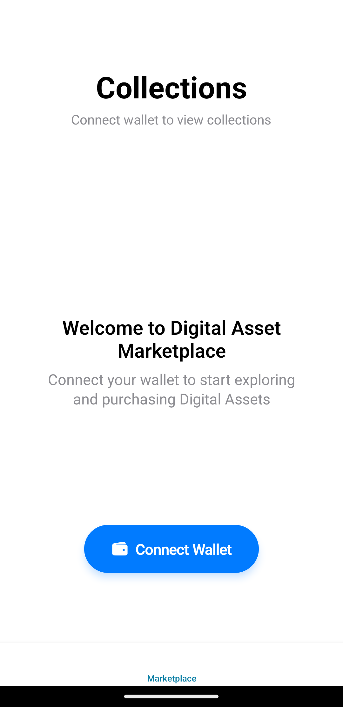
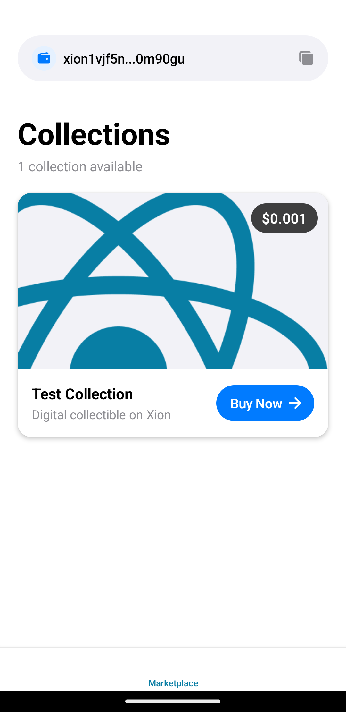
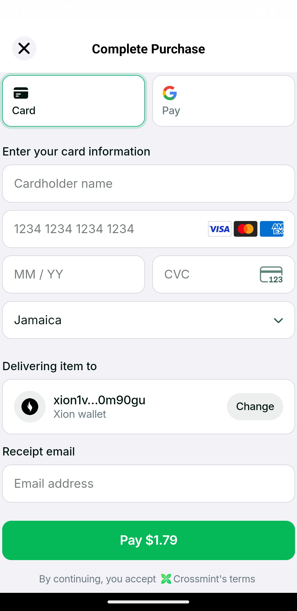

# Integrate Credit Card Payments for Digital Assets in Your Mobile App Using Crossmint

This guide demonstrates how to enable credit card purchases for Digital Assets on the XION blockchain using Crossmint's payment infrastructure. We'll use a React Native mobile app as our primary example, showing real-world implementation patterns and solutions to common challenges.


## Architecture Overview

Here’s a high-level breakdown of how the flow works from the user’s perspective:

```
User → Mobile App → Crossmint Checkout → XION Account
```

Let’s dig deeper into the components:

* **Mobile App (React Native)**: This is your Digital Asset storefront, where users browse collections and initiate purchases.
* **Crossmint Checkout**: A drop-in payment solution that supports fiat (credit/debit) and crypto. It handles compliance, processing, and minting.
* **XION Blockchain**: The final destination where the Digital Asset is minted and stored in the user’s wallet.

Here’s what happens under the hood:

1. User selects a Digital Asset and clicks "Buy"
2. Crossmint’s embedded checkout opens inside the app
3. User enters their credit card info and confirms payment
4. Crossmint processes the transaction and mints the Digital Asset
5. Digital Asset is delivered to the user’s XION wallet

This architecture lets you offer a familiar ecommerce-like UX.


## Prerequisites

Before diving in, let’s make sure you have the essentials ready.

### Accounts You’ll Need

* **Crossmint**: [Sign up](https://staging.crossmint.com) on the staging environment first. You’ll get access to the Crossmint Console, where you’ll create collections, manage keys, and configure payments.
* **GitHub**: We'll reference public repos and you’ll likely want version control.

### Development Environment

Make sure you have the following installed:

* Node.js v18+ and npm
* iOS or Android emulator (or a physical device)
* VS Code (recommended)


## Crossmint Setup

Let’s begin with the Crossmint side of the integration. This is where we define your Digital Asset collection, configure payment options, and generate the credentials your app will use.

### 1. Create a Crossmint Account

Start by registering on [staging.crossmint.com](https://staging.crossmint.com). This is their testing environment. After signing up, verify your email and complete the developer onboarding flow.

### 2. Create a Project

Inside the Crossmint Console:

* Click **Create Project**
* Enter a **Project name**
* Click the **Create project** button

This will give you a unique Project ID you’ll use in your app.

### 3. Generate an API Key

This step is **crucial**, especially for mobile apps.

* Navigate to **Integrate ->** **API Keys**
* Under **Client-side keys** click **Create new key** button
* For **App type** select **Mobile**
* For Origin enter your **iOS bundle ID** or **Android package name**
* Under scopes, select only: `orders.create`&#x20;
* Click the **Create client key** button

### 4. Create Collection

The Crossmint team has enabled the creation of NFT collections directly within the Console. These collections are based on the [**CW-721 Metadata Onchain**](https://github.com/public-awesome/cw-nfts/tree/main/contracts/cw721-metadata-onchain) contract. You can also import a custom NFT contract, as long as it is built on the [**CW-721 Metadata Onchain**](https://github.com/public-awesome/cw-nfts/tree/main/contracts/cw721-metadata-onchain) standard.

To create your collection, follow these steps:

1. Click the "**Token collections**" link in the menu sidebar and then click the "**New collection**" button

<figure><figcaption></figcaption></figure>

2. Enter the collection information and click "**Next**"
3. On the "**Create or import your collection contract**" step select "**Create a new contract**" and then click "**Next**". If you have your own custom NFT contract select "**Import an existing contract**"
4. On the "What do you want to do with this collection?" section select "**Sell NFTs**" and click "**Next**"
5. On "**Choose a chain**" select "**Xion**" and click "**Next**"
6. On "**Payment settings**" enter a price for the collection, select who pays the fees and enter an address that will receive the revenue from sales
7. Review details and click the "**Create collection**" button to complete the process

### 5. Create an NFT

On the "**Token collections**" page select the collection created above. The NFTs tab is selected by default, click "**manual upload**" and in the window that pops up enter the NFT information.

<figure><figcaption></figcaption></figure>

Click the "**Create NFT**" button when done.

### 6. Update Checkout Settings

Click the "**Checkout**" tab and make sure the "**NFT Price**" and "**Recipient address**" are filled in and then click "**Save changes**".

Also make sure "**Enable Credit Card payments"** is enabled under "**Payment methods**".

<figure><figcaption></figcaption></figure>


## Deploy a Treasury Contract <a href="#deploying-a-treasury-contract-for-gasless-transactions" id="deploying-a-treasury-contract-for-gasless-transactions"></a>

To successfully integrate the **Abstraxion SDK** into the app, we first need to deploy a **Treasury Contract**. In this particular use case the Treasury contract is required for users to log into the app.

### Steps to Deploy a Treasury Contract <a href="#steps-to-deploy-a-treasury-contract" id="steps-to-deploy-a-treasury-contract"></a>

1. Login to the [XION Developer Portal](https://dev.testnet.burnt.com/).
2. Click the **"New Treasury"** button to create a new treasury contract instance.
3. **Select the appropriate configurations**. The default "**Fee Grant (Allowance)**" and "**Grant Config (Permission)**" should be enough for this application.

You will then copy the treasury contract address which will be required in the app setup below.


## Building the Mobile App <a href="#building-the-frontend" id="building-the-frontend"></a>

We've created a mobile app to allow users to purchase from Digital Asset collections created within the Crossmint platform . The app can be downloaded at [https://github.com/burnt-labs/xion-crossmint-mobile-app](https://github.com/burnt-labs/xion-crossmint-mobile-app).

### Manual Installation <a href="#manual-installation" id="manual-installation"></a>

You will first need to clone the repository:

```bash
git clone https://github.com/burnt-labs/xion-crossmint-mobile-app.git
```

After doing so you will have to change into the newly created directory and then execute the steps below.

1. Install dependencies:

```bash
cd xion-crossmint-mobile-app
npm install
```

2. Copy the **`.env.example`** file and name it **`.env.local`** and set the values with the correct information:

```javascript
# XION Configuration
EXPO_PUBLIC_TREASURY_CONTRACT_ADDRESS="your-treasury-contract-address"
EXPO_PUBLIC_RPC_ENDPOINT="https://rpc.xion-testnet-2.burnt.com:443"
EXPO_PUBLIC_REST_ENDPOINT="https://api.xion-testnet-2.burnt.com"

# Crossmint Configuration
EXPO_PUBLIC_CROSSMINT_API_KEY="your-crossmint-api-key"
```

| Variable                                  | Description                                                                 |
| ----------------------------------------- | --------------------------------------------------------------------------- |
| EXPO\_PUBLIC\_TREASURY\_CONTRACT\_ADDRESS | Treasury address used for gasless transactions and grantz authorization     |
| EXPO\_PUBLIC\_RPC\_ENDPOINT               | RPC endpoint for Xion (default: `https://rpc.xion-testnet-2.burnt.com:443`) |
| EXPO\_PUBLIC\_REST\_ENDPOINT              | REST endpoint for Xion (default: `https://api.xion-testnet-2.burnt.com`)    |
| EXPO\_PUBLIC\_CROSSMINT\_API\_KEY         | Crossmint API key (https://www.crossmint.com/console)                       |


3. Update collection list:

This list contains the NFT contract addresses and their corresponding collection IDs that users will be able to purchase.\
Open the `data/collections.json` file and add your collections using the following format:

```json
{
  "collections": [
    {
      "id": "your-collection-id",
      "contractAddress": "your-nft-contract-address"
    }
  ]
} 
```

You can find the collection ID on the listing page for each collection. To copy it, simply click the copy icon next to the desired collection ID.

<figure><figcaption></figcaption></figure>

To find the NFT contract click on the collection and then click the "**Smart contract**" tab and copy the smart "**Contract address**".

<figure><figcaption></figcaption></figure>

4. Build and start the application. Make sure your Android emulator or iOS simulator is running:



```
npx expo run:android
```



```
npx expo run:ios
```



When testing the Checkout and credit card payments on staging you’ll need to use test card numbers. You can find the list of test credit card numbers here [https://docs.crossmint.com/payments/advanced/testing-tips#test-credit-card-numbers](https://docs.crossmint.com/payments/advanced/testing-tips#test-credit-card-numbers).

You should see the following when not logged in:

<figure><figcaption></figcaption></figure>

After logging in you should see the following:

<figure><figcaption></figcaption></figure>

When you click the **Buy Now** button on any collection you will see the following:

<figure><figcaption></figcaption></figure>
