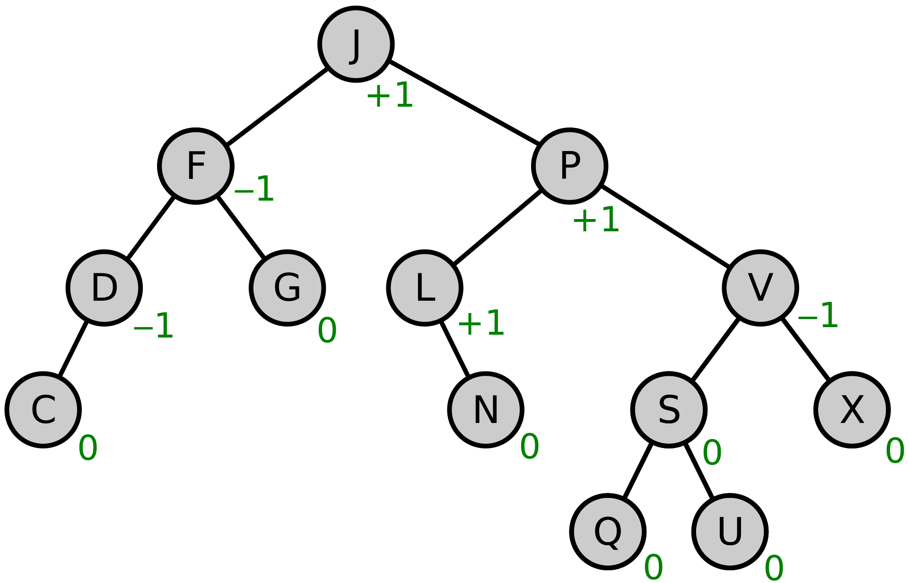

# Key Value Storage

As previously highlighted, the key-value storage mechanism in Cosmos-SDK operates on the premise that each value is stored under a corresponding key.&#x20;

This storage system is organized within a tree structure, specifically following the cosmos/iavl tree model.&#x20;

To understand the workings of this key-value storage approach, let's delve into its mechanics:

\

<figure><figcaption>
<a href="https://github.com/cosmos/iavl">cosmos/iavl </a>tree model
</figcaption></figure>

In order to facilitate your understanding of KV store iterators, let's employ a highly simplified analogy. Imagine letters enclosed within circles, where each letter represents a key, and each key is associated with a corresponding value.

Let's continue by considering a set of saved key-value pairs:

**J** -> value1

**JF** -> value2

**JPV** -> value3

**JPVA** -> value4

**JPVD** -> value5

**JPVX** -> value6

Fetching a Single Value with a Known Key is an Efficient O(1) Operation. However, When Navigating Through a Set of Keys, It's Achieved Through Prefix-Based Iteration.

**J** key, prefixes: **J**

**JF** key, prefixes: **J, JF**

**JPV** key, prefixes: **J,JP, JPV**

**JPVA** key, prefixes: **J,JP, JPV, JPVA**

**JPVD** key, prefixes: **J,JP, JPV, JPVD**

**JPVX** key, prefixes: **J,JP, JPV, JPVX**

range(**J**) returns all keys because all have **J** as prefix range(**JF**) returns only **JF**

\
This is where it gets intriguing.: range(**JPV**) returns **JPV**, **JPVA**, **JPVD**, **JPVX** in order As you can see **J** or **JF** is not returned, because values after JPV is requested.

But Why Was **JPVA** Returned?

The keys stored in the database are in the form of fixed-length strings. For instance, if we assume that keys are uniformly 8 characters in length, the storage representation of "**JPVA**" would be "**JPVA0000**".

When a range request is initiated, the underlying process systematically iterates over all keys within a specific range, starting from "**JPV00000**" and concluding at "**JPVFFFFF**." In this case, "**JPVA**" (among other keys) naturally falls within this range. It's important to note that a range query can also be executed in reverse, offering flexibility in key retrieval.

We have two fundamental operations at play: Retrieving Individual Values and Iterating

There are just two core functionalities in operation: fetching a single value or navigating through a collection of keys. While data structures often require intricate relationships, we work within the confines of this constrained key-value storage, where these two fundamental operations are paramount.

This is accomplished through the construction of indexes.\
