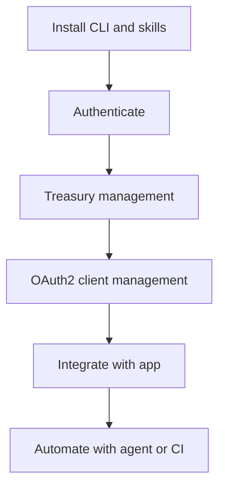

# Verona Agent Toolkit

Verona Agent Toolkit (CLI package `verona-toolkit`) is a CLI-first toolkit for building on the Verona network with Meta Accounts and gasless workflows.

This guide is for developers who are new to Verona but already comfortable with CLI tools and AI coding agents.


**Beta:** Verona Agent Toolkit is in **beta**. It supports **testnet** (default) and **mainnet**. Use testnet for development and the faucet; switch to mainnet when you are ready for production (see [Networks](#networks) below).



This page focuses on practical onboarding and high-signal workflows. For complete command coverage, use the official repository references linked throughout this guide.


## Why use this toolkit

Verona Agent Toolkit is useful when you want to:

- Automate **Treasury management** from terminal or scripts
- Manage **OAuth2 clients** for your app lifecycle
- Work with AI agents using a repeatable, documented setup
- Build gasless flows without handling private keys directly

If you need conceptual background first, see:

- [Generalized Abstraction](../../about-verona/concepts/generalized-abstraction.md)
- [Enabling Gasless Transactions with Treasury](../accounts/getting-started/treasury-contracts.md)

## Installation

### Install CLI

**macOS / Linux**

```bash
curl --proto '=https' --tlsv1.2 -LsSf \
  https://github.com/burnt-labs/verona-agent-toolkit/releases/latest/download/verona-agent-toolkit-installer.sh | sh
```

**Windows (PowerShell)**

```powershell
powershell -c "irm https://github.com/burnt-labs/verona-agent-toolkit/releases/latest/download/verona-agent-toolkit-installer.ps1 | iex"
```

### Install skills for AI agents

```bash
npx skills add burnt-labs/verona-agent-toolkit -g
verona-toolkit auth login
```

Bundled skills include `verona-dev`, `verona-toolkit-init`, `verona-oauth2`, `verona-oauth2-client`, `verona-treasury`, `verona-faucet`, and `verona-asset`. See [Skills Guide](https://github.com/burnt-labs/verona-agent-toolkit/blob/main/docs/skills-guide.md) for routing and advanced chain operations via optional [xion-skills](https://github.com/burnt-labs/xion-skills).

### Verify install

```bash
verona-toolkit --version
verona-toolkit --help
```

For full installation detail:

- [README](https://github.com/burnt-labs/verona-agent-toolkit/blob/main/README.md)
- [INSTALL-FOR-AGENTS.md](https://raw.githubusercontent.com/burnt-labs/verona-agent-toolkit/main/INSTALL-FOR-AGENTS.md)

## Networks

Verona Agent Toolkit targets **testnet** by default and also supports **mainnet**. Pick the network that matches your Treasury and OAuth2 setup.

| Network | CLI flag / config | Notes |
| ------- | ----------------- | ----- |
| **Testnet** | Default, or `--network testnet`, or `verona-toolkit config set-network testnet` | Use for development; faucet and test tokens are available |
| **Mainnet** | `--network mainnet`, or `verona-toolkit config set-network mainnet` | Production Meta Accounts, Treasuries, and OAuth2 clients |

Examples:

```bash
# One-off mainnet command
verona-toolkit --network mainnet status

# Persist default network
verona-toolkit config set-network mainnet
```

For full CLI flags and configuration, see the [Verona Agent Toolkit repository](https://github.com/burnt-labs/verona-agent-toolkit) and [Configuration](https://github.com/burnt-labs/verona-agent-toolkit/blob/main/docs/configuration.md) docs.


**OAuth2 client portal by network:** Manage OAuth2 clients in the [testnet portal](https://oauth2.testnet.burnt.com/) or [mainnet portal](https://oauth2.burnt.com/). See [OAuth2 App Development](../accounts/oauth2-app.md).


## Authentication (refresh-first pattern)

Use OAuth2-based auth with local encrypted credentials:

```bash
verona-toolkit auth login
verona-toolkit auth status
verona-toolkit auth refresh
```

Recommended pattern:

1. Check `auth status`
2. Try `auth refresh` first if credentials exist
3. Run `auth login` only when needed

If you plan to manage OAuth2 clients, authenticate with:

```bash
verona-toolkit auth login --dev-mode
```

## Quick start (Treasury + OAuth2 client)

### 1) Check your environment

```bash
verona-toolkit status
verona-toolkit account info
```

### 2) Claim testnet tokens (optional, testnet only)

```bash
verona-toolkit faucet claim
```

### 3) Create and fund a Treasury

```bash
verona-toolkit treasury create \
  --name "My Treasury" \
  --redirect-url "https://your-app.example/callback"
```

```bash
verona-toolkit treasury fund xion1... --amount 1000000uxion
```

### 4) Configure Treasury permissions

Use `grant-config` and `fee-config` commands to define delegated actions and fee sponsorship.

```bash
verona-toolkit treasury grant-config --help
verona-toolkit treasury fee-config --help
```

### 5) Manage OAuth2 clients

```bash
verona-toolkit oauth2 client --help
```

Use this command group to create, update, query, and manage OAuth2 client ownership/managers for your app.

## AI agent workflow

If you want your AI agent to set everything up, copy this exact instruction:

```text
Follow this guide https://raw.githubusercontent.com/burnt-labs/verona-agent-toolkit/main/INSTALL-FOR-AGENTS.md to install and configure the Verona Agent Toolkit skills for AI agents.
```

Recommended skills for this guide:

- `verona-dev`
- `verona-toolkit-init`
- `verona-oauth2`
- `verona-treasury`
- `verona-oauth2-client`
- `verona-faucet`
- `verona-asset`

## Workflow map



## Common how-to tasks

- **Switch network** (`testnet` or `mainnet`)
  - `verona-toolkit config set-network testnet`
  - `verona-toolkit config set-network mainnet`
  - Or pass `--network mainnet` (or `testnet`) on any command
- **Use machine-readable output**
  - `verona-toolkit --output json <command>`
- **Disable prompts for automation**
  - `verona-toolkit --no-interactive <command>`
- **Track a transaction**
  - `verona-toolkit tx wait <TX_HASH>`
- **Backup Treasury setup**
  - `verona-toolkit treasury export <TREASURY_ADDR>`
- **Install shell completions**
  - `verona-toolkit completions --install`

## Troubleshooting

- **CLI not found**
  - Ensure `$HOME/.cargo/bin` is on your `PATH`, then open a new shell session
- **Token expired**
  - Run `verona-toolkit auth refresh`
- **Port already in use during login**
  - Run `verona-toolkit auth login --port 54322`
- **Scope error for OAuth2 client commands**
  - Re-login with `verona-toolkit auth login --dev-mode`

For complete error handling details:

- [Error Codes](https://github.com/burnt-labs/verona-agent-toolkit/blob/main/docs/ERROR-CODES.md)

## Detailed references

- [Verona Agent Toolkit Repository](https://github.com/burnt-labs/verona-agent-toolkit)
- [CLI Reference](https://github.com/burnt-labs/verona-agent-toolkit/blob/main/docs/cli-reference.md)
- [Quick Reference](https://github.com/burnt-labs/verona-agent-toolkit/blob/main/docs/QUICK-REFERENCE.md)
- [Skills Guide](https://github.com/burnt-labs/verona-agent-toolkit/blob/main/docs/skills-guide.md)
- [Install for AI Agents](https://raw.githubusercontent.com/burnt-labs/verona-agent-toolkit/main/INSTALL-FOR-AGENTS.md)
