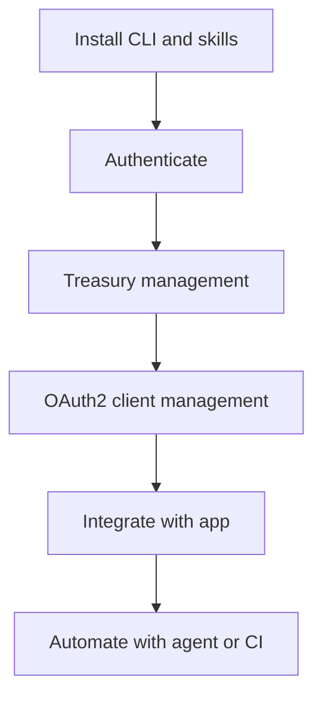

# Xion Agent Toolkit

Xion Agent Toolkit is a CLI-first toolkit for building on XION with Meta Accounts and gasless workflows.

This guide is for developers who are new to XION but already comfortable with CLI tools and AI coding agents.


**Beta:** Xion Agent Toolkit is in **beta**. **Mainnet is not supported** yet—use **XION testnet** for all development and testing.



This page focuses on practical onboarding and high-signal workflows. For complete command coverage, use the official repository references linked throughout this guide.


## Why use this toolkit

Xion Agent Toolkit is useful when you want to:

- Automate **Treasury management** from terminal or scripts
- Manage **OAuth2 clients** for your app lifecycle
- Work with AI agents using a repeatable, documented setup
- Build gasless flows without handling private keys directly

If you need conceptual background first, see:

- [Generalized Abstraction](../../xions-core/concepts/generalized-abstraction.md)
- [Enabling Gasless Transactions with Treasury](../accounts/getting-started/treasury-contracts.md)

## Installation

### Install CLI

**macOS / Linux**

```bash
curl --proto '=https' --tlsv1.2 -LsSf \
  https://github.com/burnt-labs/xion-agent-toolkit/releases/latest/download/xion-agent-toolkit-installer.sh | sh
```

**Windows (PowerShell)**

```powershell
powershell -c "irm https://github.com/burnt-labs/xion-agent-toolkit/releases/latest/download/xion-agent-toolkit-installer.ps1 | iex"
```

### Install skills for AI agents

```bash
npx skills add burnt-labs/xion-agent-toolkit -g
```

### Verify install

```bash
xion-toolkit --version
xion-toolkit --help
```

For full installation detail:

- [README](https://github.com/burnt-labs/xion-agent-toolkit/blob/main/README.md)
- [INSTALL-FOR-AGENTS.md](https://raw.githubusercontent.com/burnt-labs/xion-agent-toolkit/main/INSTALL-FOR-AGENTS.md)

## Authentication (refresh-first pattern)

Use OAuth2-based auth with local encrypted credentials:

```bash
xion-toolkit auth login
xion-toolkit auth status
xion-toolkit auth refresh
```

Recommended pattern:

1. Check `auth status`
2. Try `auth refresh` first if credentials exist
3. Run `auth login` only when needed

If you plan to manage OAuth2 clients, authenticate with:

```bash
xion-toolkit auth login --dev-mode
```

## Quick start (Treasury + OAuth2 client)

### 1) Check your environment

```bash
xion-toolkit status
xion-toolkit account info
```

### 2) Claim testnet tokens (optional, testnet only)

```bash
xion-toolkit faucet claim
```

### 3) Create and fund a Treasury

```bash
xion-toolkit treasury create \
  --name "My Treasury" \
  --redirect-url "https://your-app.example/callback"
```

```bash
xion-toolkit treasury fund xion1... --amount 1000000uxion
```

### 4) Configure Treasury permissions

Use `grant-config` and `fee-config` commands to define delegated actions and fee sponsorship.

```bash
xion-toolkit treasury grant-config --help
xion-toolkit treasury fee-config --help
```

### 5) Manage OAuth2 clients

```bash
xion-toolkit oauth2 client --help
```

Use this command group to create, update, query, and manage OAuth2 client ownership/managers for your app.

## AI agent workflow

If you want your AI agent to set everything up, copy this exact instruction:

```text
Follow this guide https://raw.githubusercontent.com/burnt-labs/xion-agent-toolkit/main/INSTALL-FOR-AGENTS.md to install and configure the Xion Agent Toolkit skills for AI agents.
```

Recommended skills for this guide:

- `xion-dev`
- `xion-oauth2`
- `xion-treasury`
- `xion-oauth2-client`

## Workflow map



## Common how-to tasks

- **Switch network** (during beta, **testnet** only)
  - `xion-toolkit config set-network testnet`
- **Use machine-readable output**
  - `xion-toolkit --output json <command>`
- **Disable prompts for automation**
  - `xion-toolkit --no-interactive <command>`
- **Track a transaction**
  - `xion-toolkit tx wait <TX_HASH>`
- **Backup Treasury setup**
  - `xion-toolkit treasury export <TREASURY_ADDR>`

## Troubleshooting

- **CLI not found**
  - Add your install path to `PATH` and open a new shell session
- **Token expired**
  - Run `xion-toolkit auth refresh`
- **Port already in use during login**
  - Run `xion-toolkit auth login --port 54322`
- **Scope error for OAuth2 client commands**
  - Re-login with `xion-toolkit auth login --dev-mode`

For complete error handling details:

- [Error Codes](https://github.com/burnt-labs/xion-agent-toolkit/blob/main/docs/ERROR-CODES.md)

## Detailed references

- [Xion Agent Toolkit Repository](https://github.com/burnt-labs/xion-agent-toolkit)
- [CLI Reference](https://github.com/burnt-labs/xion-agent-toolkit/blob/main/docs/cli-reference.md)
- [Quick Reference](https://github.com/burnt-labs/xion-agent-toolkit/blob/main/docs/QUICK-REFERENCE.md)
- [Skills Guide](https://github.com/burnt-labs/xion-agent-toolkit/blob/main/docs/skills-guide.md)
- [Install for AI Agents](https://raw.githubusercontent.com/burnt-labs/xion-agent-toolkit/main/INSTALL-FOR-AGENTS.md)
