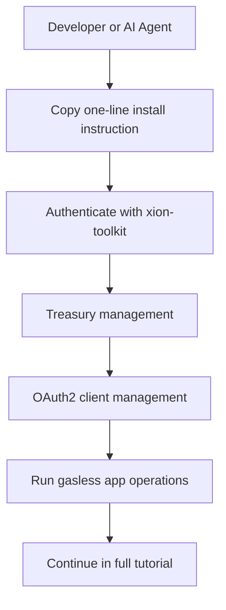

# AI Agent Quick Start

Want to let an AI agent operate on XION with a gasless workflow?

Copy the instruction below into your AI coding assistant:

```text
Follow this guide https://raw.githubusercontent.com/burnt-labs/xion-agent-toolkit/main/INSTALL-FOR-AGENTS.md to install and configure the Xion Agent Toolkit skills for AI agents.
```


This setup is designed for AI-assisted development on XION with Meta Accounts, Treasury management, and OAuth2 client management. It is not limited to one IDE.


## What this gives you

- **MetaAccount auth** via OAuth2 (no private key management)
- **Treasury management** for gasless operations and delegated permissions
- **OAuth2 client management** for app registration and lifecycle
- **Agent-friendly workflows** through skills like `xion-dev`, `xion-oauth2`, `xion-treasury`, and `xion-oauth2-client`

## High-level flow



## Continue to full guide

<table data-view="cards">
  <thead>
    <tr>
      <th></th>
      <th data-hidden data-card-target data-type="content-ref"></th>
    </tr>
  </thead>
  <tbody>
    <tr>
      <td><strong>Xion Agent Toolkit Tutorial</strong><br>Step-by-step guide for installation, auth, treasury workflows, OAuth2 client management, and troubleshooting.</td>
      <td><a href="../developers/tools/xion-toolkit.md">xion-toolkit</a></td>
    </tr>
  </tbody>
</table>

## References

- [Xion Agent Toolkit Repository](https://github.com/burnt-labs/xion-agent-toolkit)
- [Install for AI Agents](https://raw.githubusercontent.com/burnt-labs/xion-agent-toolkit/main/INSTALL-FOR-AGENTS.md)
- [CLI Reference](https://github.com/burnt-labs/xion-agent-toolkit/blob/main/docs/cli-reference.md)
